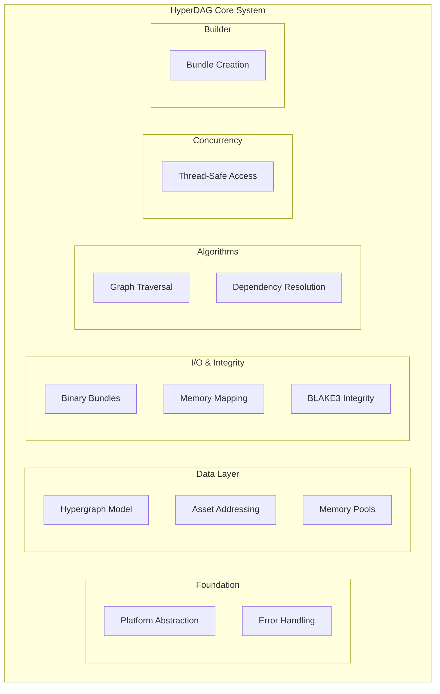

# HyperDAG - Mathematical Hypergraph Foundation for Asset Management

> **This is a WIP!**

[](https://github.com/hyperdag/hyperdag-core/actions)
[](https://github.com/hyperdag/hyperdag-core/actions)
[](https://slsa.dev)

A high-performance C23 library providing mathematical hypergraph foundations for complex asset dependency management. HyperDAG enables hyperedges that connect multiple nodes simultaneously, representing rich N-to-M relationships impossible with traditional graphs.

## What is HyperDAG?

> _Graphs. All. The. Way. Down._

HyperDAG implements the core mathematical structure underlying TurtlGraph's asset management system. It provides:

- **🔗 Hypergraph Mathematics**: Hyperedges connecting multiple nodes (e.g., "this material depends on these 3 textures and 2 shaders")
- **💾 Memory-Mapped Bundles**: Zero-copy binary format with cryptographic integrity
- **⚡ Lock-Free Performance**: Concurrent access optimized for multi-core systems
- **🛡️ Memory Safety**: Comprehensive sanitizer coverage and deterministic cleanup
- **🏗️ Modern C23**: Contemporary safety practices with broad platform support

## Architecture Overview



## Core Features

### 🎯 Hypergraph Mathematics ([F.001](docs/features/F001-core-hypergraph-data-model.md))

- **Hypernodes**: Assets with 128-bit content-addressed IDs
- **Hyperedges**: Connect N sources to M targets with typed relationships
- **O(1) Lookup**: Hash-based node access with efficient edge enumeration
- **Memory Efficient**: Arena allocation with cache-friendly layout

### 💽 Binary Bundle Format ([F.002](docs/features/F002-binary-bundle-format.md))

```text
[Header: 64B][Index: Variable][Edges: Variable][Store: Variable]
```

- **Memory Mapped**: Zero-copy access with pointer hydration
- **Cross-Platform**: Unified format for Windows/Linux/macOS
- **Compressed**: LZ4/Zstandard optimization for size vs speed
- **Integrity**: BLAKE3 cryptographic verification

### ⚡ High Performance

- **Lock-Free Reads**: Atomic operations for concurrent access
- **NUMA Aware**: Memory binding for multi-socket systems
- **Thread-Safe**: Reader-writer locks with deadlock prevention
- **Streaming I/O**: Platform-optimized (io_uring, DirectStorage)

## Quick Start

> **Note**: HyperDAG is currently in architectural design phase. Implementation begins with foundation layer.

### Architecture Complete ✅

```bash
# Review comprehensive feature specifications
ls docs/features/
# F001-core-hypergraph-data-model.md
# F002-binary-bundle-format.md
# ... (12 total features)

# Examine third-party library recommendations
cat docs/3rd-party.md
```

### Planned API (Implementation Pending)

```c
#include "hyperdag/hyperdag.h"

int main() {
    // Create hypergraph with memory pool
    hyperdag_graph_config_t config = {
        .initial_node_capacity = 10000,
        .enable_concurrent_access = true,
        .memory_pool_size = 64 * 1024 * 1024  // 64MB
    };

    hyperdag_graph_t* graph;
    hyperdag_result_t result = hyperdag_graph_create(&config, &graph);
    if (result != HYPERDAG_SUCCESS) return 1;

    // Add nodes (assets)
    hyperdag_id_t texture_id, shader_id, material_id;

    hyperdag_node_metadata_t texture_meta = {
        .name = "brick_diffuse.png",
        .type = HYPERDAG_ASSET_TYPE_TEXTURE,
        .data_size = 2048 * 2048 * 4,
        .hash = compute_asset_hash(texture_data)
    };
    hyperdag_graph_add_node(graph, &texture_meta, &texture_id);

    // Create hyperedge: material depends on texture + shader
    hyperdag_edge_metadata_t edge_meta = {
        .type = HYPERDAG_EDGE_TYPE_DEPENDENCY,
        .weight = 1.0f,
        .node_count = 3,
        .nodes = (hyperdag_id_t[]){material_id, texture_id, shader_id}
    };
    hyperdag_graph_add_edge(graph, &edge_meta, NULL);

    // Dependency resolution
    hyperdag_id_t* sorted_assets;
    size_t asset_count;
    hyperdag_dependency_resolve(graph, &sorted_assets, &asset_count);

    hyperdag_graph_destroy(graph);
    return 0;
}
```

## Implementation Status

### ✅ Complete

- **Architecture**: 12 features fully specified with dependencies
- **Third-Party Selection**: Libraries evaluated with integration guides
- **API Design**: Core C interfaces defined with examples
- **Documentation**: Comprehensive specs with Mermaid diagrams

### 🔄 Next Phase (Ready to Start)

- **Foundation Layer**: Platform abstraction and error handling ([F.010](docs/features/F010-platform-abstraction.md), [F.011](docs/features/F011-error-handling-validation.md))
- **Core Implementation**: Hypergraph data structures ([F.001](docs/features/F001-core-hypergraph-data-model.md))
- **Memory Management**: Object pools and arenas ([F.009](docs/features/F009-memory-pool-management.md))

## Technology Stack

### Selected Libraries

| Component | Library | Rating | Notes |
|-----------|---------|--------|-------|
| **Cryptography** | [BLAKE3](https://github.com/BLAKE3-team/BLAKE3) | ⭐⭐⭐⭐⭐ | Official implementation with SIMD |
| **Threading** | [tinycthread](https://github.com/tinycthread/tinycthread) | ⭐⭐⭐⭐ | C11 compatibility + atomics |
| **Memory** | [mimalloc](https://github.com/microsoft/mimalloc) | ⭐⭐⭐⭐ | High performance + custom arenas |
| **Hash Tables** | [uthash](https://github.com/troydhanson/uthash) | ⭐⭐⭐⭐ | Flexible macro-based implementation |

### Custom Components

- **Platform Abstraction**: Thin wrapper for file I/O and memory mapping
- **I/O Layer**: DirectStorage (Windows) and io_uring (Linux) optimization
- **Memory Pools**: Specialized allocators for hypergraph patterns

## Building

### Requirements

- **C23 Compiler**: GCC 13+, Clang 17+, MSVC 2022+
- **CMake**: 3.28+ with modern practices
- **Platform**: Windows 10+, Linux 5.4+, macOS 12+

### Development Environment Setup

```bash
# Automated development environment setup
./scripts/setup-dev-env.sh

# Or verify existing environment  
./scripts/setup-dev-env.sh --verify

# Check what tools are missing
./scripts/setup-dev-env.sh --dry-run
```

The setup script automatically:
- Installs required tools (cmake, clang, gitleaks, etc.)
- Configures git hooks for quality enforcement
- Sets up clang-tidy and clang-format
- Validates C23 tool compatibility
- Provides optional git configuration improvements

### Build Configuration

```bash
# Standard release build
cmake -B build -DCMAKE_BUILD_TYPE=Release
cmake --build build

# Development with all sanitizers
cmake -B build -DCMAKE_BUILD_TYPE=Debug -DHYPERDAG_DEV=ON -DHYPERDAG_SANITIZERS=ON

# Static analysis
cmake --build build --target static-analysis

# Performance profiling
./scripts/profile.sh all
```

See [CONTRIBUTING.md](CONTRIBUTING.md) for complete development guidelines and build system documentation.

## Performance Targets

| Operation | Target Performance |
|-----------|-------------------|
| Node Lookup | O(1) average, <100ns |
| Bundle Loading | >1GB/s on NVMe |
| Concurrent Reads | Linear scaling to 16 threads |
| Memory Overhead | <5% of graph data |

## Documentation

### Architecture & Design

- **[Feature Specifications](docs/features/)**: Complete technical specifications
- **[Third-Party Integration](docs/3rd-party.md)**: Library selection and usage guides

### Development Guides

- **[CONTRIBUTING.md](CONTRIBUTING.md)**: Complete development guidelines and standards
- **[CLAUDE.md](CLAUDE.md)**: AI-specific development context
- **API Reference**: Generated from implementation (pending)
- **Performance Guide**: Optimization recommendations (pending)

## HyperDAG vs TurtlGraph

**HyperDAG** (This Repository):

- Mathematical hypergraph foundation
- Binary bundle format and I/O
- Memory management and concurrency primitives
- Pure C23 library with minimal dependencies

**TurtlGraph** (Production System):

- Game engine integration and UI
- Network protocols and caching
- Content pipeline and asset processing
- Production deployment features

## Contributing

1. **Set Up Environment**: Run `./scripts/setup-dev-env.sh` for complete development setup
2. **Review Architecture**: Study feature specifications in `docs/features/`
3. **Understand Dependencies**: Check third-party integration guides
4. **Follow Standards**: C23 practices with comprehensive testing
5. **Quality Gates**: >95% coverage, sanitizer-clean, static analysis passing

**DevContainer (Recommended)**:
Use the provided DevContainer for instant setup with VS Code.

**Manual Setup**:
```bash
# Set up development environment
./scripts/setup-dev-env.sh

# Validate contribution
ctest --test-dir build --output-on-failure
cmake --build build --target static-analysis
./scripts/run-gitleaks.sh
```

For detailed contribution guidelines, see [CONTRIBUTING.md](CONTRIBUTING.md).

## Development Timeline

- **Phase 1** (Weeks 1-2): Foundation and core data structures
- **Phase 2** (Weeks 3-5): I/O system and binary format
- **Phase 3** (Weeks 6-7): Algorithms and concurrency
- **Phase 4** (Weeks 8-9): Builder system and integration

See [Feature Specifications](docs/features/) for detailed implementation roadmap.

## License

Apache License 2.0 - see [LICENSE](LICENSE) for details.

## Contact

- **Technical Questions**: GitHub Issues
- **Security Reports**: <james@flyingrobots.dev>
- **Development**: Reference [CLAUDE.md](CLAUDE.md) for AI-assisted development context

---

_HyperDAG: The mathematical foundation enabling "everything is graphs" for modern asset management._
