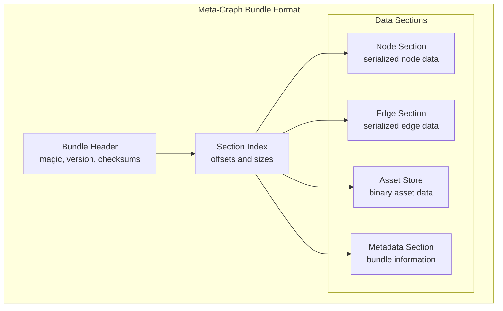
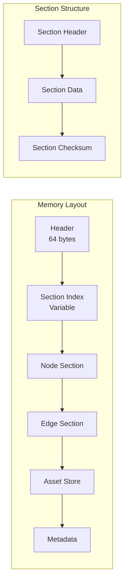
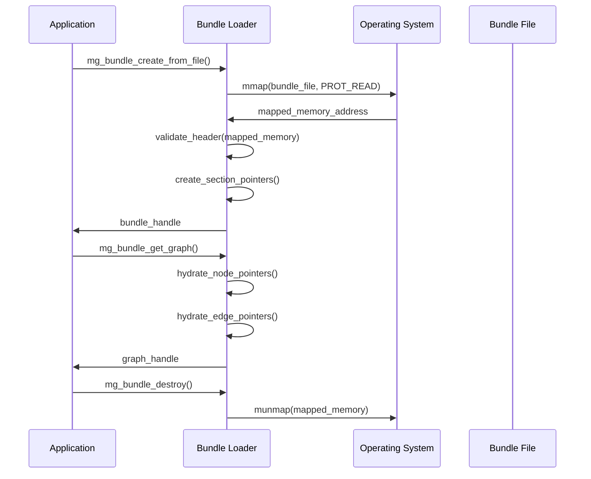

# F.002 - Binary Bundle Format

## Feature Overview

The Binary Bundle Format implements the core serialization structure discovered in the origin story: `{header}{index}{edges}{store}`. This format enables efficient storage and memory-mapped loading of meta-graphs, providing the foundation for TurtlGraph's performance characteristics.

The format is designed for:
- **Memory-mapped I/O** - Direct access without full deserialization
- **Cross-platform compatibility** - Endian-neutral and architecture-independent
- **Integrity verification** - Built-in checksums and validation
- **Streaming support** - Progressive loading and partial access

## Priority
**Critical** - Core persistence and I/O foundation

## Dependencies
- F.001 - Core Hypergraph Data Model (graph structures to serialize)
- F.007 - Asset ID and Addressing (stable identifiers)
- F.011 - Error Handling and Validation (error reporting)

## User Stories

### F002.US001 - Define Binary Format Structure
**As a** system developer
**I want** a standardized binary format for meta-graphs
**So that** graphs can be efficiently stored and loaded across platforms

**Prerequisites:**
- Hypergraph data model defined (F.001)
- Asset ID system available (F.007)

**Acceptance Criteria:**
- Format has clear header with magic number and version
- Cross-platform compatible (endian-neutral)
- Self-describing with embedded metadata
- Supports forward and backward compatibility

### F002.US002 - Implement Memory-Mapped Loading
**As a** performance engineer
**I want** to load bundles without full deserialization
**So that** large asset collections can be accessed efficiently

**Prerequisites:**
- Binary format specification complete
- Platform abstraction for memory mapping (F.010)

**Acceptance Criteria:**
- Can memory-map bundle files directly
- Pointers are hydrated on access, not load
- Supports partial loading of bundle sections
- Minimal memory overhead for unused assets

### F002.US003 - Bundle Validation and Integrity
**As a** security engineer
**I want** built-in integrity verification
**So that** corrupted or tampered bundles are detected

**Prerequisites:**
- Binary format with checksum fields
- Hash computation available

**Acceptance Criteria:**
- Header contains bundle-wide checksum
- Individual sections have integrity hashes
- Validation can be performed incrementally
- Clear error reporting for corruption

### F002.US004 - Cross-Platform Compatibility
**As a** platform engineer
**I want** bundles to work across different architectures
**So that** assets can be shared between development and target platforms

**Prerequisites:**
- Platform abstraction layer (F.010)
- Endianness detection and conversion

**Acceptance Criteria:**
- Bundles load correctly on different endian systems
- Pointer sizes handled appropriately (32/64-bit)
- Alignment requirements respected
- Performance equivalent to native format

### F002.US005 - Version Management
**As a** system developer
**I want** format versioning and migration support
**So that** bundles remain compatible as the format evolves

**Prerequisites:**
- Version field in bundle header
- Migration strategy defined

**Acceptance Criteria:**
- Bundle format version is clearly identified
- Older versions can be loaded with warnings
- Migration path for format updates
- Graceful handling of unsupported versions

## API Design

```c
// Bundle file format structures
typedef struct {
    char magic[8];              // "METAGRAPH"
    uint32_t version;           // Format version
    uint32_t flags;             // Feature flags
    uint64_t total_size;        // Total bundle size
    uint64_t header_checksum;   // Header integrity
    uint64_t bundle_checksum;   // Full bundle integrity
    uint32_t section_count;     // Number of sections
    uint32_t reserved;          // Future use
} mg_bundle_header_t;

typedef struct {
    uint32_t type;              // Section type (nodes, edges, store)
    uint32_t flags;             // Section flags
    uint64_t offset;            // Offset from bundle start
    uint64_t size;              // Section size in bytes
    uint64_t checksum;          // Section integrity hash
    uint32_t item_count;        // Number of items in section
    uint32_t reserved;          // Future use
} mg_section_header_t;

// Bundle loading API
typedef struct mg_bundle mg_bundle_t;

mg_result_t mg_bundle_create_from_file(
    const char* file_path,
    const mg_bundle_options_t* options,
    mg_bundle_t** out_bundle
);

mg_result_t mg_bundle_create_from_memory(
    const void* data,
    size_t data_size,
    const mg_bundle_options_t* options,
    mg_bundle_t** out_bundle
);

mg_result_t mg_bundle_destroy(mg_bundle_t* bundle);

mg_result_t mg_bundle_validate(
    const mg_bundle_t* bundle,
    mg_validation_flags_t flags
);

mg_result_t mg_bundle_get_graph(
    const mg_bundle_t* bundle,
    mg_graph_t** out_graph
);

// Bundle section access
mg_result_t mg_bundle_get_section(
    const mg_bundle_t* bundle,
    mg_section_type_t type,
    const void** out_data,
    size_t* out_size
);

// Bundle metadata
typedef struct {
    uint64_t creation_time;
    uint64_t modification_time;
    char creator[64];
    char description[256];
    uint32_t target_platform;
    uint32_t compression_type;
} mg_bundle_metadata_t;

mg_result_t mg_bundle_get_metadata(
    const mg_bundle_t* bundle,
    mg_bundle_metadata_t* out_metadata
);
```

## Binary Format Specification

### Format Versioning and Compatibility

**Current Version**: 1
**Format UUID**: `550e8400-e29b-41d4-a716-446655440000`

#### Compatibility Matrix

| Bundle Format | API Version | Status | Notes |
|---------------|-------------|--------|-------|
| v1 | 0.1.x | ✅ Current | Initial implementation |
| v1 | 0.2.x | 🔄 Planned | Forward compatibility via feature flags |
| v2 | 1.0.x | 📋 Future | Major format revision for performance |

#### Migration Strategy
- **Forward Compatibility**: Bundle v1 will support API 0.2.x via reserved fields
- **Backward Compatibility**: API 0.2.x will read Bundle v1 with degraded features
- **Breaking Changes**: Bundle v2 will require migration tools for existing data

#### Fallback Strategy for I/O Failures
- **Network Shares**: Fall back to buffered I/O when mmap fails on remote filesystems
- **FAT32/ExFAT**: Handle filesystems without sparse file support gracefully
- **Memory Pressure**: Provide streaming alternatives when mmap exceeds available address space
- **Permission Issues**: Detect and handle read-only or permission-restricted files

### Bundle Format Structure



### Detailed Section Layout



## Format Details

### Bundle Header (80 bytes - Updated for Future-Proofing)
```c
struct mg_bundle_header {
    char magic[8];              // "METAGRAPH" magic identifier
    uint8_t format_uuid[16];    // Format UUID for version identification
    uint32_t format_version;    // Binary format version (current: 1)
    uint32_t api_version;       // API version compatibility (major.minor)
    uint32_t flags;             // COMPRESSED=1, ENCRYPTED=2, SIGNED=4, DELTA=8
    uint32_t reserved_flags;    // Reserved for future feature flags
    uint64_t total_size;        // Total bundle size in bytes
    uint64_t creation_time;     // Unix timestamp (UTC)
    uint64_t bundle_id;         // Unique bundle identifier
    uint64_t header_checksum;   // BLAKE3 hash of header (excluding this field)
    uint64_t bundle_checksum;   // BLAKE3 hash of entire bundle content
    uint32_t section_count;     // Number of data sections
    uint32_t delta_base_id;     // Base bundle ID for delta patches (0 if full)
    uint64_t reserved[2];       // Reserved for future extensions
};

// Format UUID for Bundle Format v1
#define METAGRAPH_BUNDLE_FORMAT_V1_UUID \
    {0x55, 0x0e, 0x84, 0x00, 0xe2, 0x9b, 0x41, 0xd4, \
     0xa7, 0x16, 0x44, 0x66, 0x55, 0x44, 0x00, 0x00}
```

### Section Types
- **SECTION_NODES** (0x01) - Serialized node data with metadata
- **SECTION_EDGES** (0x02) - Serialized hyperedge data
- **SECTION_STORE** (0x03) - Binary asset content
- **SECTION_INDEX** (0x04) - Asset ID to offset mapping
- **SECTION_METADATA** (0x05) - Bundle metadata and properties

### Memory Mapping Strategy



## Endianness Handling

All multi-byte values are stored in little-endian format for consistency. On big-endian platforms, automatic byte swapping is performed during access.

```c
// Endian-safe reading
static inline uint32_t read_uint32_le(const void* ptr) {
    const uint8_t* bytes = (const uint8_t*)ptr;
    return (uint32_t)bytes[0] |
           ((uint32_t)bytes[1] << 8) |
           ((uint32_t)bytes[2] << 16) |
           ((uint32_t)bytes[3] << 24);
}

static inline uint64_t read_uint64_le(const void* ptr) {
    const uint8_t* bytes = (const uint8_t*)ptr;
    return (uint64_t)read_uint32_le(bytes) |
           ((uint64_t)read_uint32_le(bytes + 4) << 32);
}
```

## Implementation Notes

### Memory Mapping Considerations
- Use `MAP_PRIVATE` for read-only access to prevent accidental modification
- Handle systems without memory mapping via fallback buffered I/O
- Respect system page size for alignment (typically 4KB)
- Consider huge pages for very large bundles on supporting systems

### Pointer Hydration
- Store relative offsets, not absolute pointers
- Convert offsets to pointers on first access
- Cache hydrated pointers for performance
- Handle pointer arithmetic carefully across platforms

### Validation Strategy
- Fast path: validate only header and critical checksums
- Full validation: verify all section checksums
- Streaming validation: validate sections as they're accessed
- Progressive validation for large bundles

## Test Plan

### Unit Tests
1. **Format Validation**
   - Correctly formed headers are accepted
   - Malformed headers are rejected
   - Checksum validation works correctly
   - Version compatibility checking

2. **Memory Mapping**
   - Successfully map valid bundle files
   - Handle memory mapping failures gracefully
   - Proper cleanup of mapped memory
   - Performance comparison vs. file I/O

3. **Cross-Platform**
   - Same bundle loads on different endian systems
   - Pointer hydration works correctly
   - Alignment requirements are met
   - Performance parity across platforms

### Integration Tests
1. **Bundle Creation and Loading**
   - Create bundle from meta-graph, load back successfully
   - Round-trip preserves all graph data
   - Memory usage stays within bounds

2. **Error Handling**
   - Corrupted bundles are detected
   - Missing files handled gracefully
   - Out-of-memory conditions handled

### Performance Tests
1. **Loading Performance**
   - Memory-mapped loading vs. traditional file I/O
   - Cold vs. warm loading times
   - Memory usage during loading

2. **Access Patterns**
   - Random access performance
   - Sequential access performance
   - Partial bundle loading efficiency

## Acceptance Criteria Summary

✅ **Functional Requirements:**
- Binary format loads meta-graphs correctly
- Memory-mapped I/O works efficiently
- Cross-platform compatibility verified
- Integrity validation detects corruption
- Version management handles format evolution

✅ **Performance Requirements:**
- Memory-mapped loading faster than full deserialization
- Minimal memory overhead for unused sections
- O(1) access to bundle sections
- Scalable to multi-gigabyte bundles

✅ **Quality Requirements:**
- Comprehensive test coverage for format edge cases
- Validation tools for bundle integrity
- Documentation of format specification
- Performance benchmarks vs. alternatives

This feature implements the fundamental serialization insight from the origin story, enabling the efficient storage and loading that makes TurtlGraph's performance characteristics possible.
