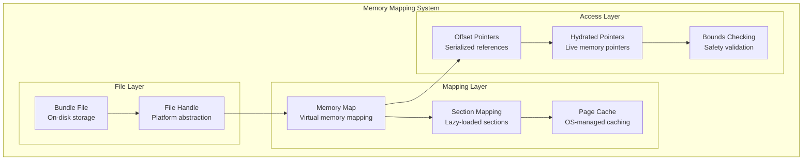
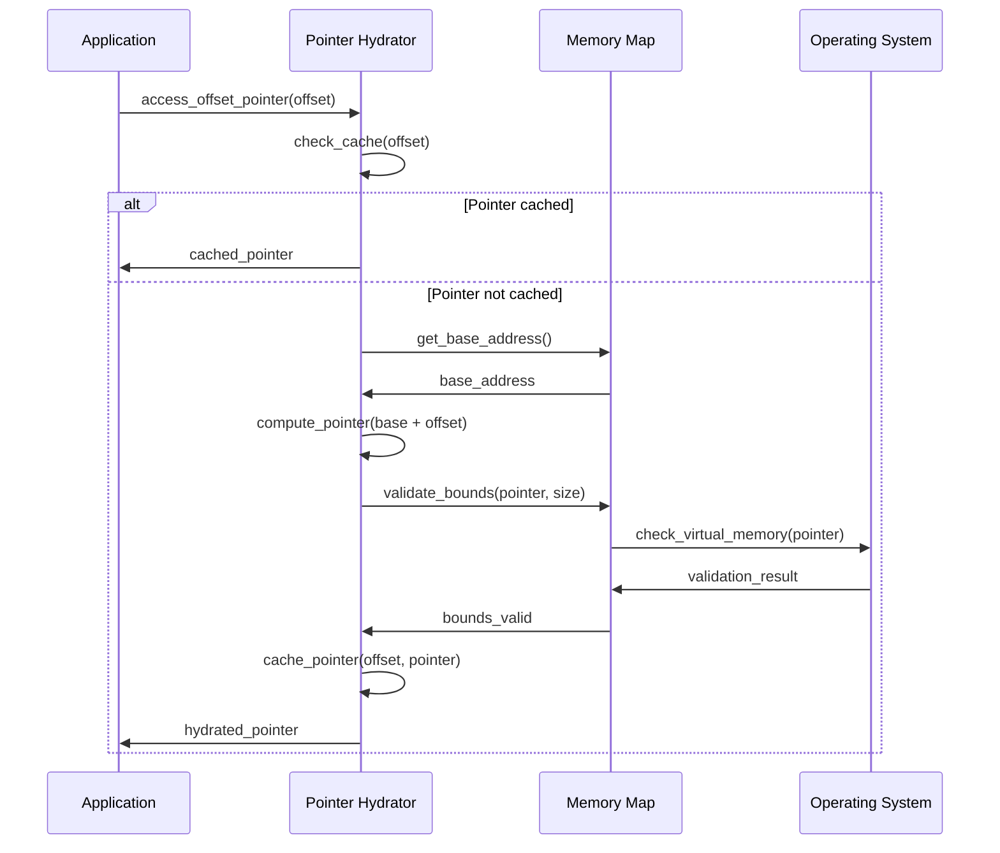
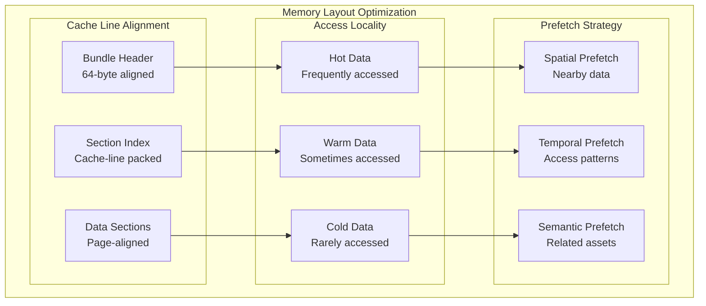

# F.003 - Memory-Mapped I/O Operations

## Feature Overview

The Memory-Mapped I/O Operations feature implements the core insight from the origin story: efficient access to bundle data through memory mapping with pointer hydration. This enables direct access to serialized meta-graph data without full deserialization, providing the performance foundation for TurtlGraph's capabilities.

This feature implements the binary format's memory-mapped access strategy where offsets are converted to pointers on first access, enabling lazy loading and minimal memory overhead for large bundles.

## Priority
**Critical** - Core I/O foundation for performance

## Dependencies
- F.010 - Platform Abstraction (memory mapping, file I/O)
- F.009 - Memory Pool Management (allocation strategies)
- F.011 - Error Handling and Validation (error reporting, validation)

## User Stories

### F003.US001 - Memory-Mapped Bundle Loading
**As a** performance engineer
**I want** to memory-map bundle files for direct access
**So that** large bundles can be loaded instantly without full deserialization

**Prerequisites:**
- Platform abstraction for memory mapping (F.010)
- Bundle format specification (F.002)

**Acceptance Criteria:**
- Can memory-map bundle files of any size
- Mapping works across different platforms (Windows, Linux, macOS)
- Handles mapping failures gracefully (fallback to buffered I/O)
- Supports read-only and read-write mapping modes
- Automatic page alignment and size calculations

### F003.US002 - Pointer Hydration System
**As a** system developer
**I want** automatic conversion of file offsets to memory pointers
**So that** serialized data structures can be accessed directly

**Prerequisites:**
- Memory-mapped file access
- Understanding of data layout and alignment

**Acceptance Criteria:**
- Converts relative offsets to absolute pointers on first access
- Handles pointer arithmetic safely across platforms
- Validates pointer bounds before hydration
- Caches hydrated pointers for performance
- Handles alignment requirements for different architectures

### F003.US003 - Lazy Loading and Streaming
**As a** system developer
**I want** to load bundle sections on-demand
**So that** memory usage is minimized and startup time is reduced

**Prerequisites:**
- Section-based bundle format
- Memory mapping infrastructure

**Acceptance Criteria:**
- Loads bundle sections only when accessed
- Supports streaming access patterns
- Maintains memory usage bounds
- Provides prefetching hints for access patterns
- Handles partial bundle loading efficiently

### F003.US004 - Cross-Platform Memory Management
**As a** platform engineer
**I want** consistent memory mapping behavior across platforms
**So that** bundles work identically on all target systems

**Prerequisites:**
- Platform abstraction layer (F.010)
- Understanding of platform memory models

**Acceptance Criteria:**
- Identical behavior on Windows, Linux, macOS
- Handles different page sizes (4KB, 64KB, 2MB)
- Supports both 32-bit and 64-bit pointer models
- Manages virtual memory efficiently
- Provides platform-specific optimizations where beneficial

### F003.US005 - Hot Reload Support
**As a** developer
**I want** to detect and reload changed bundle files
**So that** asset changes are reflected immediately during development

**Prerequisites:**
- File system monitoring capabilities
- Memory mapping infrastructure

**Acceptance Criteria:**
- Detects file changes through filesystem monitoring
- Safely remaps memory without disrupting active operations
- Preserves cached data where possible
- Provides callbacks for change notifications
- Handles concurrent access during reload

## API Design

```c
// Memory mapping structures
typedef struct {
    void* base_address;
    size_t mapped_size;
    size_t file_size;
    bool is_writable;
    bool is_coherent;
    void* platform_handle;
} mg_memory_map_t;

typedef struct {
    uint64_t offset;        // Offset from base address
    size_t size;           // Size of mapped region
    uint32_t access_flags; // Read/write permissions
    uint32_t cache_flags;  // Caching behavior hints
} mg_mapping_request_t;

// Memory-mapped I/O operations
mg_result_t mg_mmap_create_from_file(
    mg_file_t* file,
    const mg_mapping_request_t* request,
    mg_memory_map_t** out_map
);

mg_result_t mg_mmap_create_from_memory(
    void* buffer,
    size_t size,
    bool writable,
    mg_memory_map_t** out_map
);

mg_result_t mg_mmap_destroy(mg_memory_map_t* map);

mg_result_t mg_mmap_sync(
    mg_memory_map_t* map,
    uint64_t offset,
    size_t size
);

mg_result_t mg_mmap_advise(
    mg_memory_map_t* map,
    uint64_t offset,
    size_t size,
    mg_memory_advice_t advice
);

// Pointer hydration system
typedef struct {
    uint64_t offset;        // Offset from base address
    void* cached_pointer;   // Cached hydrated pointer
    bool is_hydrated;      // Whether pointer has been computed
    uint32_t access_count; // Number of times accessed
} mg_offset_pointer_t;

mg_result_t mg_hydrate_pointer(
    const mg_memory_map_t* map,
    mg_offset_pointer_t* offset_ptr,
    void** out_pointer
);

mg_result_t mg_validate_pointer(
    const mg_memory_map_t* map,
    const void* pointer,
    size_t required_size
);

// Batch pointer hydration for performance
mg_result_t mg_hydrate_pointer_batch(
    const mg_memory_map_t* map,
    mg_offset_pointer_t* offset_ptrs,
    size_t count
);

// Streaming and lazy loading
typedef struct {
    uint64_t section_offset;
    size_t section_size;
    bool is_loaded;
    void* cached_data;
    uint32_t reference_count;
} mg_section_handle_t;

mg_result_t mg_section_load(
    mg_memory_map_t* map,
    mg_section_handle_t* section,
    void** out_data
);

mg_result_t mg_section_unload(
    mg_memory_map_t* map,
    mg_section_handle_t* section
);

mg_result_t mg_section_prefetch(
    mg_memory_map_t* map,
    mg_section_handle_t* sections,
    size_t section_count
);

// Hot reload support
typedef void (*mg_reload_callback_t)(
    const char* file_path,
    mg_memory_map_t* old_map,
    mg_memory_map_t* new_map,
    void* user_data
);

typedef struct mg_file_watcher mg_file_watcher_t;

mg_result_t mg_file_watcher_create(
    const char* file_path,
    mg_reload_callback_t callback,
    void* user_data,
    mg_file_watcher_t** out_watcher
);

mg_result_t mg_file_watcher_destroy(mg_file_watcher_t* watcher);

// Memory advice types
typedef enum {
    METAGRAPH_ADVICE_NORMAL,     // Normal access pattern
    METAGRAPH_ADVICE_SEQUENTIAL, // Sequential access expected
    METAGRAPH_ADVICE_RANDOM,     // Random access expected
    METAGRAPH_ADVICE_WILLNEED,   // Will be needed soon
    METAGRAPH_ADVICE_DONTNEED,   // Won't be needed soon
    METAGRAPH_ADVICE_NOREUSE     // Won't be reused
} mg_memory_advice_t;

// Performance monitoring
typedef struct {
    uint64_t total_mapped_bytes;
    uint64_t active_mapped_bytes;
    uint32_t page_faults;
    uint32_t cache_hits;
    uint32_t cache_misses;
    double average_hydration_time_ns;
} mg_mmap_stats_t;

mg_result_t mg_mmap_get_stats(mg_mmap_stats_t* out_stats);
mg_result_t mg_mmap_reset_stats(void);
```

## Memory Mapping Architecture



## Pointer Hydration Process



## Cross-Platform Memory Mapping

```mermaid
graph TD
    subgraph "Platform-Specific Implementation"
        subgraph "Windows"
            WIN_CREATE[CreateFileMapping]
            WIN_MAP[MapViewOfFile]
            WIN_ADVICE[PrefetchVirtualMemory]
        end

        subgraph "Linux"
            LINUX_MMAP[mmap(2)]
            LINUX_ADVICE[madvise(2)]
            LINUX_HUGE[MAP_HUGETLB]
        end

        subgraph "macOS"
            MACOS_MMAP[mmap(2)]
            MACOS_ADVICE[madvise(2)]
            MACOS_VM[vm_allocate]
        end

        subgraph "Unified API"
            METAGRAPH_API[Meta-Graph Memory API]
        end

        WIN_CREATE --> METAGRAPH_API
        WIN_MAP --> METAGRAPH_API
        WIN_ADVICE --> METAGRAPH_API

        LINUX_MMAP --> METAGRAPH_API
        LINUX_ADVICE --> METAGRAPH_API
        LINUX_HUGE --> METAGRAPH_API

        MACOS_MMAP --> METAGRAPH_API
        MACOS_ADVICE --> METAGRAPH_API
        MACOS_VM --> METAGRAPH_API
    end
```

## Performance Optimization Strategies

### Memory Access Patterns
```c
// Optimize for different access patterns
typedef enum {
    ACCESS_PATTERN_SEQUENTIAL,  // Linear traversal
    ACCESS_PATTERN_RANDOM,      // Random access
    ACCESS_PATTERN_CLUSTERED,   // Locality of reference
    ACCESS_PATTERN_STREAMING    // One-time sequential access
} access_pattern_t;

static const struct {
    access_pattern_t pattern;
    mg_memory_advice_t advice;
    size_t prefetch_size;
} optimization_table[] = {
    {ACCESS_PATTERN_SEQUENTIAL, METAGRAPH_ADVICE_SEQUENTIAL, 1024*1024},
    {ACCESS_PATTERN_RANDOM, METAGRAPH_ADVICE_RANDOM, 4096},
    {ACCESS_PATTERN_CLUSTERED, METAGRAPH_ADVICE_NORMAL, 64*1024},
    {ACCESS_PATTERN_STREAMING, METAGRAPH_ADVICE_SEQUENTIAL, 2*1024*1024}
};
```

### Cache-Friendly Data Layout


## Implementation Notes

### Platform-Specific Optimizations
- **Windows**: Use DirectStorage and FILE_FLAG_NO_BUFFERING for large files
- **Linux**: Leverage huge pages (MAP_HUGETLB) for large mappings
- **macOS**: Use F_NOCACHE for streaming access patterns
- **All platforms**: Align mappings to page boundaries for optimal performance

### Memory Safety
- Always validate pointer bounds before access
- Handle mapping failures gracefully with fallback mechanisms
- Use memory barriers for multi-threaded access
- Implement guard pages for buffer overflow detection

### Performance Considerations
- Batch pointer hydration to amortize overhead
- Use CPU cache prefetch instructions where available
- Implement read-ahead for sequential access patterns
- Monitor page fault rates and adjust strategies

### Hot Reload Implementation
- Use platform file system notifications (inotify, ReadDirectoryChangesW, kqueue)
- Implement copy-on-write semantics for safe updates
- Provide atomic pointer updates during reload
- Handle partial updates and rollback scenarios

## Test Plan

### Unit Tests
1. **Memory Mapping Operations**
   - Map files of various sizes successfully
   - Handle mapping failures gracefully
   - Unmap memory without leaks
   - Platform-specific path verification

2. **Pointer Hydration**
   - Convert offsets to pointers correctly
   - Cache hydrated pointers efficiently
   - Validate pointer bounds accurately
   - Handle alignment requirements

3. **Lazy Loading**
   - Load sections on-demand
   - Unload unused sections
   - Maintain reference counts correctly
   - Prefetch performance optimization

### Integration Tests
1. **Cross-Platform Compatibility**
   - Identical behavior across platforms
   - Handle different page sizes correctly
   - Performance parity within acceptable ranges
   - Error conditions handled consistently

2. **Performance Tests**
   - Memory mapping overhead measurement
   - Pointer hydration performance
   - Cache hit/miss ratios
   - Memory usage scaling

### Stress Tests
1. **Large File Handling**
   - Multi-gigabyte file mapping
   - Deep pointer hierarchies
   - Concurrent access patterns
   - Memory pressure scenarios

2. **Hot Reload Stress**
   - Rapid file changes
   - Concurrent read/reload operations
   - Large bundle updates
   - Error recovery during reload

## Acceptance Criteria Summary

✅ **Functional Requirements:**
- Memory-map bundle files efficiently across platforms
- Automatic pointer hydration with bounds checking
- Lazy loading minimizes memory usage
- Hot reload supports development workflows
- Platform-specific optimizations where beneficial

✅ **Performance Requirements:**
- Memory mapping faster than traditional file I/O
- Pointer hydration overhead is minimal
- Lazy loading reduces startup time significantly
- Cache hit rates exceed 90% for typical access patterns

✅ **Quality Requirements:**
- Memory safety validation prevents crashes
- Cross-platform behavior is consistent
- Performance regression testing
- Stress testing validates robustness under load

This memory-mapped I/O system provides the high-performance foundation that enables Meta-Graph to achieve the instant loading and minimal memory overhead that makes large-scale asset management practical.
