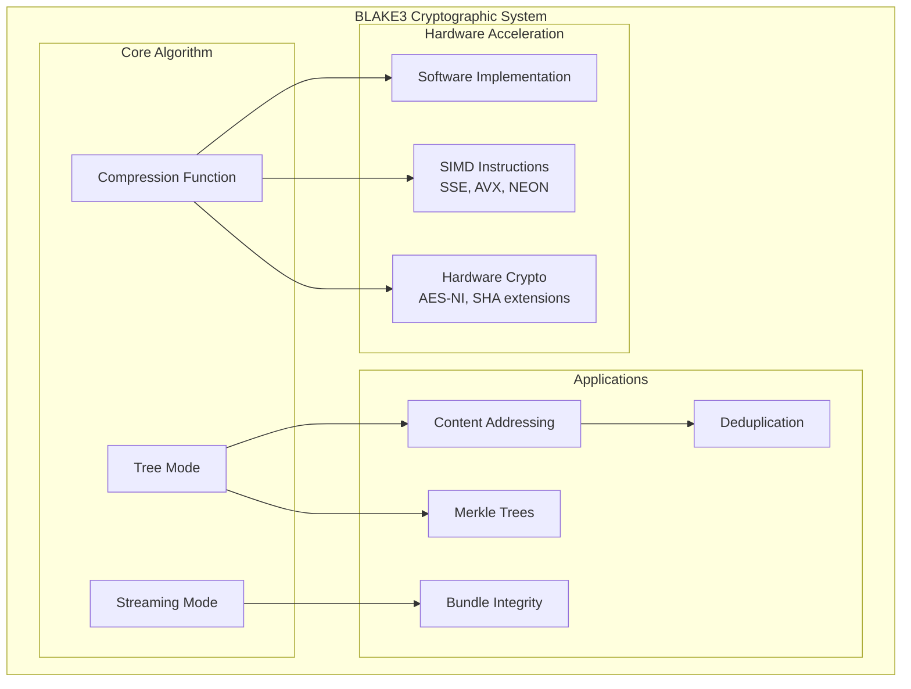
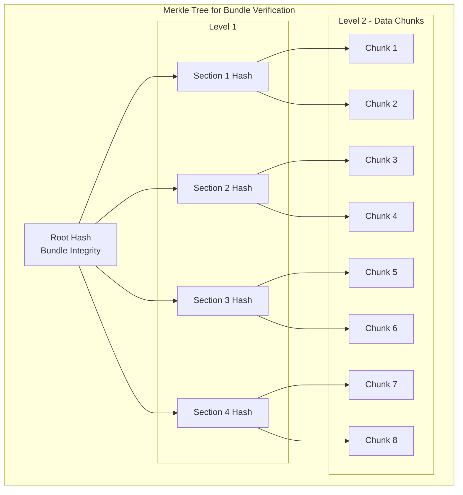
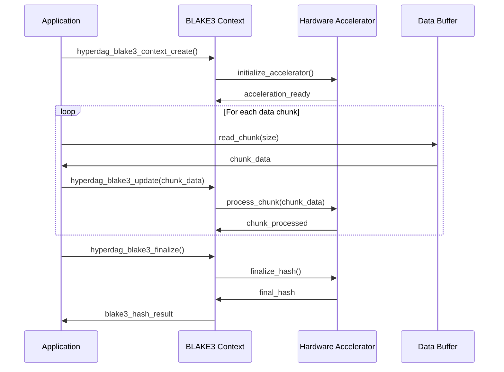
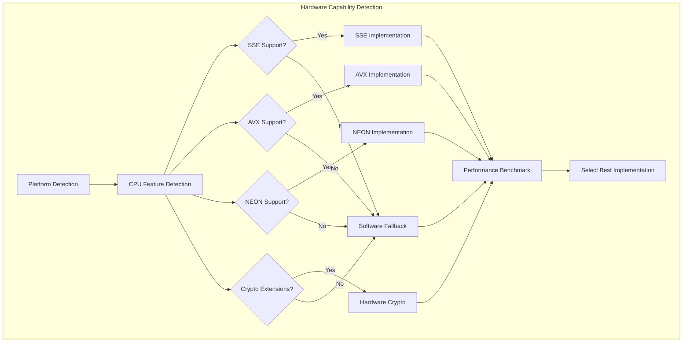

# F.004 - BLAKE3 Cryptographic Integrity

## Feature Overview

The BLAKE3 Cryptographic Integrity feature implements tamper-proof verification and content addressing using the BLAKE3 cryptographic hash function. This feature ensures data integrity throughout the asset pipeline, enables automatic deduplication, and provides the foundation for secure asset distribution.

Building on the origin story's insight about moving from simple JSON manifests to cryptographically verified binary formats, this feature provides the security and integrity guarantees essential for production asset management.

## Priority
**High** - Essential for data integrity and security

## Dependencies
- F.002 - Binary Bundle Format (structures to hash and verify)
- F.010 - Platform Abstraction (cryptographic primitives)
- F.011 - Error Handling and Validation (error reporting, validation)

## User Stories

### F004.US001 - Content Hash Generation
**As a** system developer  
**I want** to generate BLAKE3 hashes for asset content  
**So that** I can verify data integrity and enable content-based addressing  

**Prerequisites:**
- BLAKE3 algorithm implementation available
- Binary data handling capabilities (F.002)

**Acceptance Criteria:**
- Generates 256-bit BLAKE3 hashes for any data
- Supports streaming hash computation for large assets
- Provides deterministic hashes across platforms
- Optimizes for both small and large data sizes
- Implements hardware acceleration where available

### F004.US002 - Bundle Integrity Verification
**As a** security engineer  
**I want** cryptographic verification of bundle integrity  
**So that** corrupted or tampered data is detected immediately  

**Prerequisites:**
- Bundle format with integrity fields (F.002)
- Hash generation capabilities

**Acceptance Criteria:**
- Verifies entire bundle integrity with single hash
- Supports incremental verification of bundle sections
- Detects any modification to bundle data
- Provides detailed error reporting for corruption
- Maintains performance for large bundles (multi-GB)

### F004.US003 - Merkle Tree Construction
**As a** system developer  
**I want** Merkle tree verification for large bundles  
**So that** partial bundle verification and streaming validation are possible  

**Prerequisites:**
- Understanding of Merkle tree structure
- Efficient tree traversal algorithms

**Acceptance Criteria:**
- Constructs balanced Merkle trees for bundle sections
- Enables verification of individual sections without full bundle
- Supports streaming verification during download
- Provides logarithmic verification time complexity
- Handles variable-size data chunks efficiently

### F004.US004 - Hardware Acceleration
**As a** performance engineer  
**I want** hardware-accelerated BLAKE3 computation  
**So that** hash generation doesn't become a performance bottleneck  

**Prerequisites:**
- Platform abstraction for hardware detection (F.010)
- SIMD and cryptographic instruction support

**Acceptance Criteria:**
- Automatically detects and uses available hardware acceleration
- Supports SIMD instructions (SSE, AVX, NEON) where available
- Uses dedicated crypto hardware when present
- Gracefully falls back to software implementation
- Achieves significant performance improvement over software-only

### F004.US005 - Content Deduplication
**As a** storage optimization engineer  
**I want** automatic content deduplication using hashes  
**So that** identical assets are stored only once  

**Prerequisites:**
- Content hash generation
- Hash-based lookup mechanisms

**Acceptance Criteria:**
- Automatically detects duplicate content across bundles
- Provides space savings metrics for deduplication
- Maintains referential integrity for deduplicated content
- Supports cross-bundle deduplication
- Handles hash collisions gracefully (though extremely unlikely)

## API Design

```c
// BLAKE3 hash structure
typedef struct {
    uint8_t bytes[32];  // 256-bit BLAKE3 hash
} hyperdag_blake3_hash_t;

// Hash computation context for streaming
typedef struct hyperdag_blake3_context hyperdag_blake3_context_t;

// Basic hash computation
hyperdag_result_t hyperdag_blake3_hash(
    const void* data,
    size_t data_size,
    hyperdag_blake3_hash_t* out_hash
);

// Streaming hash computation
hyperdag_result_t hyperdag_blake3_context_create(
    hyperdag_blake3_context_t** out_context
);

hyperdag_result_t hyperdag_blake3_context_destroy(
    hyperdag_blake3_context_t* context
);

hyperdag_result_t hyperdag_blake3_update(
    hyperdag_blake3_context_t* context,
    const void* data,
    size_t data_size
);

hyperdag_result_t hyperdag_blake3_finalize(
    hyperdag_blake3_context_t* context,
    hyperdag_blake3_hash_t* out_hash
);

// Hash verification
hyperdag_result_t hyperdag_blake3_verify(
    const void* data,
    size_t data_size,
    const hyperdag_blake3_hash_t* expected_hash
);

// Bundle integrity
hyperdag_result_t hyperdag_bundle_compute_integrity_hash(
    const void* bundle_data,
    size_t bundle_size,
    hyperdag_blake3_hash_t* out_hash
);

hyperdag_result_t hyperdag_bundle_verify_integrity(
    const void* bundle_data,
    size_t bundle_size,
    const hyperdag_blake3_hash_t* expected_hash
);

// Merkle tree structures
typedef struct {
    hyperdag_blake3_hash_t* hashes;  // Hash values at this level
    size_t count;                    // Number of hashes at this level
} hyperdag_merkle_level_t;

typedef struct {
    hyperdag_merkle_level_t* levels; // Tree levels (leaf to root)
    size_t level_count;              // Number of levels in tree
    size_t chunk_size;               // Size of data chunks at leaves
    hyperdag_blake3_hash_t root_hash; // Root hash of the tree
} hyperdag_merkle_tree_t;

// Merkle tree operations
hyperdag_result_t hyperdag_merkle_tree_create(
    const void* data,
    size_t data_size,
    size_t chunk_size,
    hyperdag_merkle_tree_t** out_tree
);

hyperdag_result_t hyperdag_merkle_tree_destroy(
    hyperdag_merkle_tree_t* tree
);

hyperdag_result_t hyperdag_merkle_tree_verify_chunk(
    const hyperdag_merkle_tree_t* tree,
    size_t chunk_index,
    const void* chunk_data,
    size_t chunk_size
);

hyperdag_result_t hyperdag_merkle_tree_get_proof(
    const hyperdag_merkle_tree_t* tree,
    size_t chunk_index,
    hyperdag_blake3_hash_t** out_proof_hashes,
    size_t* out_proof_length
);

hyperdag_result_t hyperdag_merkle_verify_proof(
    const void* chunk_data,
    size_t chunk_size,
    size_t chunk_index,
    const hyperdag_blake3_hash_t* proof_hashes,
    size_t proof_length,
    const hyperdag_blake3_hash_t* root_hash
);

// Hardware acceleration
typedef enum {
    HYPERDAG_BLAKE3_SOFTWARE,      // Pure software implementation
    HYPERDAG_BLAKE3_SIMD,          // SIMD-accelerated (SSE, AVX, NEON)
    HYPERDAG_BLAKE3_HARDWARE       // Dedicated crypto hardware
} hyperdag_blake3_implementation_t;

typedef struct {
    hyperdag_blake3_implementation_t implementation;
    const char* implementation_name;
    uint32_t performance_factor;    // Relative performance vs software
    bool is_available;             // Whether available on this platform
} hyperdag_blake3_capability_t;

hyperdag_result_t hyperdag_blake3_get_capabilities(
    hyperdag_blake3_capability_t** out_capabilities,
    size_t* out_count
);

hyperdag_result_t hyperdag_blake3_set_implementation(
    hyperdag_blake3_implementation_t implementation
);

// Content deduplication
typedef struct hyperdag_deduplication_context hyperdag_deduplication_context_t;

hyperdag_result_t hyperdag_deduplication_context_create(
    hyperdag_deduplication_context_t** out_context
);

hyperdag_result_t hyperdag_deduplication_context_destroy(
    hyperdag_deduplication_context_t* context
);

hyperdag_result_t hyperdag_deduplication_add_content(
    hyperdag_deduplication_context_t* context,
    const void* data,
    size_t data_size,
    const char* identifier,
    bool* out_is_duplicate
);

hyperdag_result_t hyperdag_deduplication_get_stats(
    const hyperdag_deduplication_context_t* context,
    uint64_t* out_unique_bytes,
    uint64_t* out_total_bytes,
    uint64_t* out_duplicate_count
);

// Hash utilities
hyperdag_result_t hyperdag_blake3_hash_to_string(
    const hyperdag_blake3_hash_t* hash,
    char* buffer,
    size_t buffer_size
);

hyperdag_result_t hyperdag_blake3_hash_from_string(
    const char* hash_string,
    hyperdag_blake3_hash_t* out_hash
);

hyperdag_result_t hyperdag_blake3_hash_compare(
    const hyperdag_blake3_hash_t* hash1,
    const hyperdag_blake3_hash_t* hash2,
    int* out_result
);

// Performance monitoring
typedef struct {
    uint64_t hashes_computed;
    uint64_t bytes_hashed;
    uint64_t merkle_trees_created;
    uint64_t verifications_performed;
    double average_hash_time_ns;
    double average_verification_time_ns;
    hyperdag_blake3_implementation_t active_implementation;
} hyperdag_blake3_stats_t;

hyperdag_result_t hyperdag_blake3_get_stats(hyperdag_blake3_stats_t* out_stats);
hyperdag_result_t hyperdag_blake3_reset_stats(void);
```

## BLAKE3 Implementation Architecture



## Merkle Tree Structure



## Streaming Hash Computation



## Hardware Acceleration Detection



## Performance Optimization Strategies

### SIMD Optimizations
```c
// Platform-specific SIMD implementations
#ifdef HYPERDAG_TARGET_X86_64
// AVX2 implementation for x86-64
static void blake3_compress_avx2(
    const uint32_t cv[8],
    const uint8_t block[64],
    uint8_t block_len,
    uint64_t counter,
    uint8_t flags,
    uint32_t out[16]
);
#endif

#ifdef HYPERDAG_TARGET_ARM64
// NEON implementation for ARM64
static void blake3_compress_neon(
    const uint32_t cv[8],
    const uint8_t block[64],
    uint8_t block_len,
    uint64_t counter,
    uint8_t flags,
    uint32_t out[16]
);
#endif
```

### Memory Access Optimization
```c
// Cache-friendly data layout for Merkle trees
typedef struct {
    // Align to cache line boundaries
    alignas(64) hyperdag_blake3_hash_t level_0[MAX_LEAVES];
    alignas(64) hyperdag_blake3_hash_t level_1[MAX_LEAVES/2];
    alignas(64) hyperdag_blake3_hash_t level_2[MAX_LEAVES/4];
    // ... additional levels
} cache_optimized_merkle_tree_t;

// Prefetch data for better cache performance
static inline void prefetch_merkle_path(
    const hyperdag_merkle_tree_t* tree,
    size_t chunk_index
) {
    for (size_t level = 0; level < tree->level_count; level++) {
        size_t index = chunk_index >> level;
        __builtin_prefetch(&tree->levels[level].hashes[index], 0, 3);
    }
}
```

## Implementation Notes

### BLAKE3 Algorithm Details
- Use official BLAKE3 reference implementation with platform optimizations
- Implement tree hashing mode for parallel computation
- Support arbitrary output lengths (though we use 256-bit for consistency)
- Optimize for both streaming and one-shot computation patterns

### Security Considerations
- Use cryptographically secure hash function (BLAKE3 is cryptographically secure)
- Implement constant-time comparisons for hash verification
- Clear sensitive data from memory after use
- Validate all inputs to prevent buffer overflows

### Performance Considerations
- Leverage hardware acceleration where available (AES-NI, SHA extensions)
- Use SIMD instructions for parallel processing
- Optimize memory access patterns for cache efficiency
- Implement streaming computation to handle large data sets

### Merkle Tree Optimization
- Use balanced binary trees for optimal proof length
- Implement lazy evaluation for tree construction
- Cache intermediate hash computations
- Support parallel tree construction for large data sets

## Test Plan

### Unit Tests
1. **Hash Computation**
   - BLAKE3 produces correct hashes for test vectors
   - Streaming and one-shot computation produce identical results
   - Hardware and software implementations match
   - Performance meets benchmarks

2. **Bundle Integrity**
   - Bundle integrity verification detects all types of corruption
   - Large bundle verification performs acceptably
   - Partial verification works correctly
   - Error reporting is accurate and detailed

3. **Merkle Trees**
   - Tree construction produces correct root hashes
   - Proof generation and verification work correctly
   - Large trees handle efficiently
   - Edge cases (single chunk, odd number of chunks) work

### Integration Tests
1. **Real-World Scenarios**
   - Game asset bundle integrity verification
   - Large dataset (multi-GB) hash computation
   - Cross-platform hash consistency
   - Hardware acceleration utilization

2. **Performance Tests**
   - Hash computation throughput on different data sizes
   - Hardware acceleration performance gains
   - Merkle tree construction and verification speed
   - Memory usage scaling

### Security Tests
1. **Cryptographic Properties**
   - Hash collision resistance (using known test cases)
   - Avalanche effect verification
   - Pre-image resistance testing
   - Second pre-image resistance testing

2. **Attack Resistance**
   - Timing attack resistance for hash comparisons
   - Buffer overflow protection
   - Invalid input handling
   - Memory disclosure prevention

## Acceptance Criteria Summary

✅ **Functional Requirements:**
- Accurate BLAKE3 hash computation for all data sizes
- Comprehensive bundle integrity verification
- Efficient Merkle tree construction and verification
- Hardware acceleration utilization where available
- Reliable content deduplication based on hashes

✅ **Performance Requirements:**
- Hash computation throughput exceeds 1 GB/s on modern hardware
- Hardware acceleration provides 2-5x performance improvement
- Merkle tree verification scales logarithmically
- Memory usage scales linearly with data size

✅ **Security Requirements:**
- Cryptographically secure hash function implementation
- Tamper detection for all modification types
- Constant-time hash comparisons prevent timing attacks
- Memory safety prevents buffer overflows and information disclosure

This BLAKE3 cryptographic integrity system provides the security foundation that enables trustworthy asset distribution, automatic deduplication, and tamper detection essential for production asset management systems.