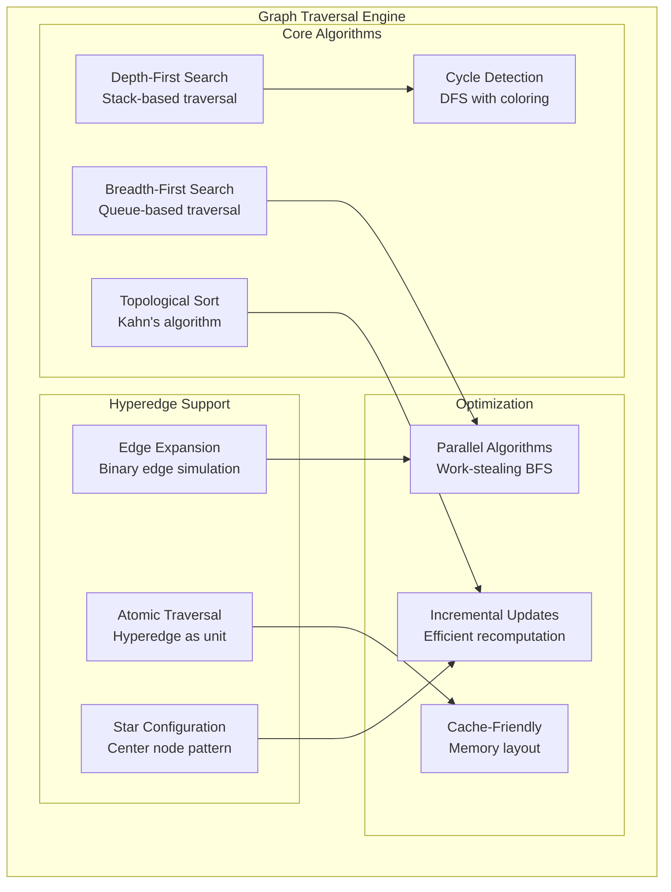
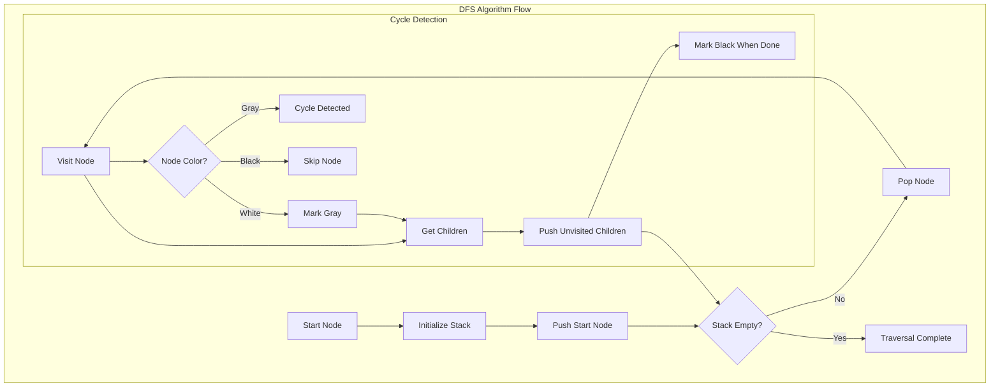
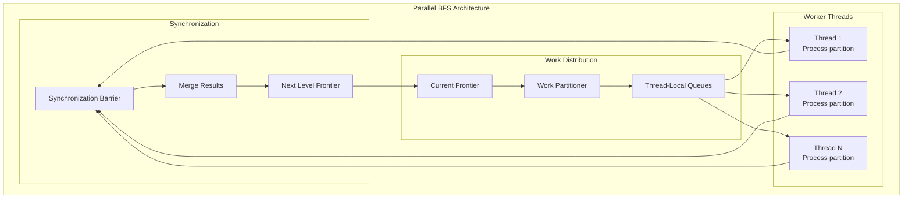
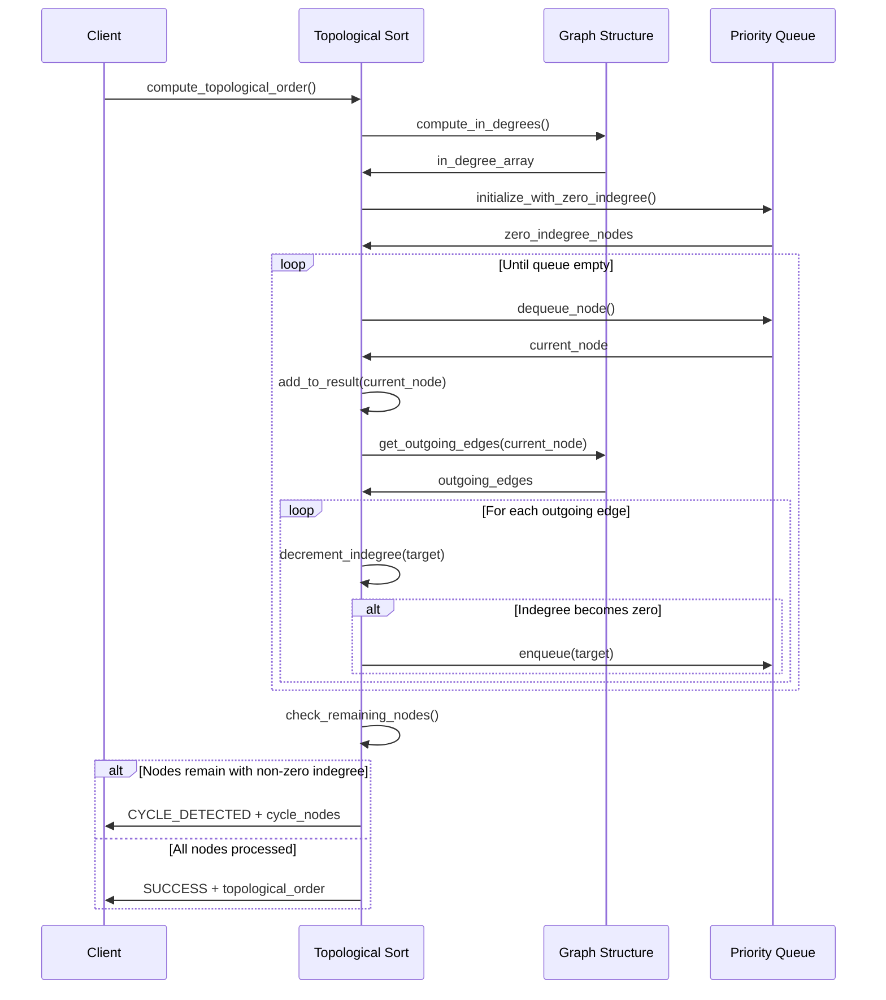

# F.005 - Graph Traversal Engine

## Feature Overview

The Graph Traversal Engine implements efficient algorithms for navigating and analyzing meta-graph structures. This feature provides the algorithmic foundation for dependency resolution, asset discovery, and graph analysis operations that are central to MetaGraph's capabilities.

Building on the origin story's insight that "everything is graphs," this engine provides high-performance traversal algorithms optimized for the sparse, hierarchical nature of asset dependency graphs.

## Priority
**Critical** - Core algorithm foundation

## Dependencies
- F.001 - Core Hypergraph Data Model (graph structures to traverse)
- F.008 - Thread-Safe Graph Access (concurrent traversal support)
- F.011 - Error Handling and Validation (error reporting, bounds checking)

## User Stories

### F005.US001 - Depth-First Search Implementation
**As a** system developer
**I want** efficient depth-first search traversal
**So that** I can explore dependency chains and detect cycles

**Prerequisites:**
- Hypergraph data model available (F.001)
- Thread-safe graph access (F.008)

**Acceptance Criteria:**
- Implements iterative DFS to avoid stack overflow
- Supports pre-order and post-order traversal modes
- Handles cycles gracefully with detection
- Provides visitor pattern for custom processing
- Memory usage scales with graph depth, not size

### F005.US002 - Breadth-First Search Implementation
**As a** system developer
**I want** efficient breadth-first search traversal
**So that** I can find shortest paths and perform level-order analysis

**Prerequisites:**
- Hypergraph data model available (F.001)
- Memory management for queue operations

**Acceptance Criteria:**
- Implements queue-based BFS algorithm
- Supports early termination on target found
- Provides distance/level information
- Memory-efficient queue implementation
- Handles disconnected graph components

### F005.US003 - Topological Ordering
**As a** dependency resolution system
**I want** to compute topological ordering of nodes
**So that** dependencies can be resolved in correct order

**Prerequisites:**
- Directed acyclic graph validation
- Cycle detection capabilities

**Acceptance Criteria:**
- Implements Kahn's algorithm for efficiency
- Detects and reports cycles in dependency graphs
- Provides stable ordering for deterministic builds
- Handles incremental updates efficiently
- Supports partial ordering for streaming resolution

### F005.US004 - Hyperedge Traversal
**As a** system developer
**I want** specialized traversal for hyperedges
**So that** complex multi-node relationships can be analyzed

**Prerequisites:**
- Hypergraph data model with hyperedges
- Understanding of hyperedge semantics

**Acceptance Criteria:**
- Traverses hyperedges as atomic units
- Supports different hyperedge interpretation modes
- Handles hyperedge weights and properties
- Efficient enumeration of hyperedge neighborhoods
- Respects hyperedge directionality where applicable

### F005.US005 - Parallel Traversal Support
**As a** performance engineer
**I want** parallel graph traversal algorithms
**So that** large graphs can be processed efficiently on multi-core systems

**Prerequisites:**
- Thread-safe graph access primitives (F.008)
- Work-stealing or partitioning strategy

**Acceptance Criteria:**
- Work-stealing parallel BFS implementation
- Thread-safe visitor pattern
- Scalable performance on multi-core systems
- Load balancing across worker threads
- Deterministic results regardless of parallelism

## API Design

```c
// Traversal context and configuration
typedef struct {
    mg_graph_t* graph;
    void* user_data;
    uint32_t max_depth;
    uint32_t max_nodes;
    bool detect_cycles;
    bool early_termination;
} mg_traversal_context_t;

// Visitor pattern for traversal callbacks
typedef enum {
    METAGRAPH_VISIT_CONTINUE,    // Continue traversal
    METAGRAPH_VISIT_SKIP,        // Skip this subtree
    METAGRAPH_VISIT_TERMINATE    // Stop entire traversal
} mg_visit_result_t;

typedef mg_visit_result_t (*mg_node_visitor_t)(
    const mg_node_t* node,
    uint32_t depth,
    void* user_data
);

typedef mg_visit_result_t (*mg_edge_visitor_t)(
    const mg_edge_t* edge,
    const mg_node_t* from_node,
    const mg_node_t* to_node,
    uint32_t depth,
    void* user_data
);

// Depth-First Search
typedef enum {
    METAGRAPH_DFS_PREORDER,     // Visit node before children
    METAGRAPH_DFS_POSTORDER,    // Visit node after children
    METAGRAPH_DFS_BOTH          // Visit node before and after children
} mg_dfs_mode_t;

mg_result_t mg_traverse_dfs(
    const mg_traversal_context_t* context,
    mg_id_t start_node,
    mg_dfs_mode_t mode,
    mg_node_visitor_t node_visitor,
    mg_edge_visitor_t edge_visitor
);

// Breadth-First Search
typedef struct {
    mg_id_t node_id;
    uint32_t distance;
    mg_id_t parent_id;
} mg_bfs_node_info_t;

mg_result_t mg_traverse_bfs(
    const mg_traversal_context_t* context,
    mg_id_t start_node,
    mg_id_t target_node,  // METAGRAPH_INVALID_ID for full traversal
    mg_node_visitor_t node_visitor,
    mg_edge_visitor_t edge_visitor,
    mg_bfs_node_info_t** out_path,
    size_t* out_path_length
);

// Topological ordering
typedef struct {
    mg_id_t* nodes;       // Topologically sorted node IDs
    size_t node_count;          // Number of nodes in ordering
    mg_id_t* cycle_nodes; // Nodes involved in cycles (if any)
    size_t cycle_count;         // Number of nodes in cycles
} mg_topological_result_t;

mg_result_t mg_compute_topological_order(
    const mg_graph_t* graph,
    mg_topological_result_t* out_result
);

mg_result_t mg_topological_result_destroy(
    mg_topological_result_t* result
);

// Incremental topological updates
typedef struct mg_topological_context mg_topological_context_t;

mg_result_t mg_topological_context_create(
    const mg_graph_t* graph,
    mg_topological_context_t** out_context
);

mg_result_t mg_topological_context_destroy(
    mg_topological_context_t* context
);

mg_result_t mg_topological_add_edge(
    mg_topological_context_t* context,
    mg_id_t from_node,
    mg_id_t to_node
);

mg_result_t mg_topological_remove_edge(
    mg_topological_context_t* context,
    mg_id_t from_node,
    mg_id_t to_node
);

// Hyperedge traversal
typedef enum {
    METAGRAPH_HYPEREDGE_EXPAND,     // Treat hyperedge as multiple binary edges
    METAGRAPH_HYPEREDGE_ATOMIC,     // Treat hyperedge as single unit
    METAGRAPH_HYPEREDGE_STARRED     // Star configuration with center node
} mg_hyperedge_mode_t;

mg_result_t mg_traverse_hyperedges(
    const mg_traversal_context_t* context,
    mg_id_t start_node,
    mg_hyperedge_mode_t mode,
    mg_node_visitor_t node_visitor,
    mg_edge_visitor_t edge_visitor
);

// Parallel traversal
typedef struct {
    uint32_t thread_count;      // Number of worker threads
    size_t work_unit_size;      // Minimum work unit for load balancing
    bool deterministic;         // Ensure deterministic ordering
} mg_parallel_config_t;

mg_result_t mg_traverse_parallel_bfs(
    const mg_traversal_context_t* context,
    mg_id_t start_node,
    const mg_parallel_config_t* parallel_config,
    mg_node_visitor_t node_visitor,
    mg_edge_visitor_t edge_visitor
);

// Graph analysis utilities
mg_result_t mg_find_shortest_path(
    const mg_graph_t* graph,
    mg_id_t start_node,
    mg_id_t end_node,
    mg_id_t** out_path,
    size_t* out_path_length
);

mg_result_t mg_find_strongly_connected_components(
    const mg_graph_t* graph,
    mg_id_t*** out_components,
    size_t** out_component_sizes,
    size_t* out_component_count
);

mg_result_t mg_detect_cycles(
    const mg_graph_t* graph,
    mg_id_t*** out_cycles,
    size_t** out_cycle_lengths,
    size_t* out_cycle_count
);

// Performance monitoring
typedef struct {
    uint64_t nodes_visited;
    uint64_t edges_traversed;
    uint64_t cycles_detected;
    double traversal_time_ms;
    size_t peak_memory_bytes;
    uint32_t thread_utilization_percent;
} mg_traversal_stats_t;

mg_result_t mg_get_traversal_stats(mg_traversal_stats_t* out_stats);
mg_result_t mg_reset_traversal_stats(void);
```

## Traversal Algorithm Architecture



## Depth-First Search Implementation



## Parallel BFS Implementation



## Topological Sort with Cycle Detection



## Performance Optimization Strategies

### Memory Access Patterns
```c
// Optimize traversal for cache efficiency
typedef struct {
    mg_id_t* nodes;       // Node IDs for current level
    size_t count;               // Number of nodes at this level
    size_t capacity;            // Allocated capacity
} level_buffer_t;

// Use level-by-level processing for better cache locality
static mg_result_t traverse_level_order(
    const mg_graph_t* graph,
    mg_id_t start_node,
    mg_node_visitor_t visitor
) {
    level_buffer_t current_level = {0};
    level_buffer_t next_level = {0};

    // Process nodes level by level for cache efficiency
    level_buffer_add(&current_level, start_node);

    while (current_level.count > 0) {
        // Process all nodes at current level
        for (size_t i = 0; i < current_level.count; i++) {
            mg_node_t* node = graph_get_node(graph, current_level.nodes[i]);
            visitor(node, level, user_data);

            // Add children to next level
            add_children_to_level(&next_level, node);
        }

        // Swap levels
        level_buffer_swap(&current_level, &next_level);
        level_buffer_clear(&next_level);
    }
}
```

### Parallel Work Distribution
```c
// Work-stealing parallel BFS implementation
typedef struct {
    atomic_size_t head;         // Head of work queue
    atomic_size_t tail;         // Tail of work queue
    mg_id_t* work_items;  // Work items buffer
    size_t capacity;            // Queue capacity
} work_stealing_queue_t;

static mg_result_t parallel_bfs_worker(
    int thread_id,
    work_stealing_queue_t* local_queue,
    work_stealing_queue_t* global_queues,
    int num_threads
) {
    while (has_work_remaining()) {
        mg_id_t node_id;

        // Try to get work from local queue first
        if (work_queue_pop(local_queue, &node_id)) {
            process_node(node_id, local_queue);
        }
        // Try to steal work from other threads
        else if (steal_work(global_queues, num_threads, thread_id, &node_id)) {
            process_node(node_id, local_queue);
        }
        else {
            // No work available, yield or wait
            thread_yield();
        }
    }
}
```

## Implementation Notes

### Stack Overflow Prevention
- Use iterative algorithms instead of recursive ones
- Implement explicit stack management for DFS
- Monitor stack depth and provide early termination
- Use heap-allocated stacks for deep graphs

### Cycle Detection Optimization
- Use node coloring (white/gray/black) for efficient cycle detection
- Implement Tarjan's algorithm for strongly connected components
- Cache cycle detection results for repeated queries
- Provide incremental cycle detection for dynamic graphs

### Memory Management
- Pre-allocate traversal data structures when possible
- Use object pools for frequently allocated/deallocated objects
- Implement memory bounds checking to prevent exhaustion
- Provide memory usage estimation for large traversals

### Thread Safety
- Use lock-free algorithms where possible
- Implement reader-writer locks for graph modifications during traversal
- Ensure deterministic results in parallel algorithms
- Provide thread-local storage for traversal state

## Test Plan

### Unit Tests
1. **Algorithm Correctness**
   - DFS visits all reachable nodes in correct order
   - BFS finds shortest paths correctly
   - Topological sort handles all valid DAGs
   - Cycle detection finds all cycles accurately

2. **Edge Cases**
   - Empty graphs and single-node graphs
   - Disconnected graph components
   - Self-loops and multiple edges
   - Maximum depth and breadth scenarios

3. **Hyperedge Traversal**
   - Different hyperedge interpretation modes
   - Large hyperedges with many nodes
   - Mixed binary edges and hyperedges
   - Hyperedge weight and property handling

### Performance Tests
1. **Scalability**
   - Linear scaling with graph size
   - Parallel algorithms show speedup
   - Memory usage remains bounded
   - Cache miss rates are acceptable

2. **Stress Testing**
   - Deep graphs (1000+ levels)
   - Wide graphs (1M+ nodes per level)
   - Dense graphs (high edge-to-node ratio)
   - Concurrent traversal and modification

### Integration Tests
1. **Real-World Scenarios**
   - Asset dependency resolution
   - Build order computation
   - Circular dependency detection
   - Incremental build optimization

## Acceptance Criteria Summary

✅ **Functional Requirements:**
- Efficient DFS, BFS, and topological sort algorithms
- Accurate cycle detection and reporting
- Specialized hyperedge traversal support
- Parallel algorithms for multi-core performance
- Visitor pattern for flexible processing

✅ **Performance Requirements:**
- Linear time complexity for basic traversals
- Near-linear speedup for parallel algorithms
- Memory usage proportional to graph size
- Cache-friendly access patterns

✅ **Quality Requirements:**
- Comprehensive test coverage for all algorithms
- Stress testing validates robustness
- Performance benchmarks track optimization
- Memory leak detection for all traversal paths

This graph traversal engine provides the algorithmic foundation that enables efficient dependency resolution, build optimization, and analysis capabilities that are central to MetaGraph's value proposition.
