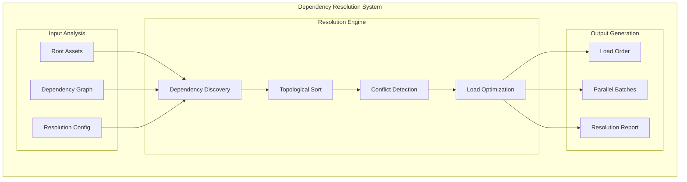
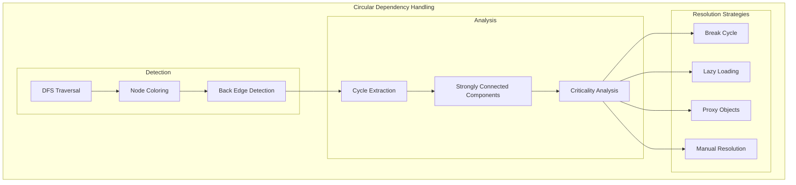
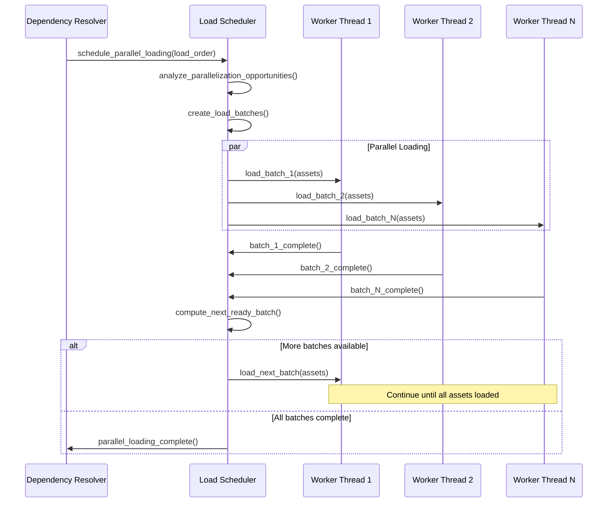
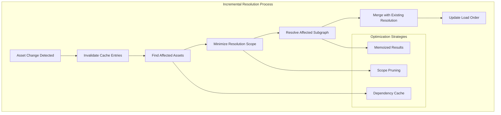

# F.006 - Dependency Resolution Algorithm

## Feature Overview

The Dependency Resolution Algorithm implements intelligent ordering and loading strategies for asset dependencies within hypergraphs. This feature builds upon the graph traversal engine to provide practical dependency management, including conflict resolution, circular dependency handling, and optimal loading order computation.

This feature realizes the origin story's vision of moving from manual JSON manifest management to automatic, intelligent dependency resolution that scales to complex asset relationships.

## Priority
**Critical** - Essential for practical asset management

## Dependencies
- F.001 - Core Hypergraph Data Model (graph structures for dependencies)
- F.005 - Graph Traversal Engine (traversal algorithms)
- F.011 - Error Handling and Validation (error reporting, conflict handling)

## User Stories

### F006.US001 - Automatic Dependency Resolution
**As a** asset pipeline developer  
**I want** automatic resolution of asset dependencies  
**So that** I don't have to manually manage complex dependency chains  

**Prerequisites:**
- Hypergraph with dependency relationships (F.001)
- Graph traversal algorithms available (F.005)

**Acceptance Criteria:**
- Automatically discovers all transitive dependencies
- Computes optimal loading order for dependencies
- Handles complex dependency graphs with thousands of assets
- Provides deterministic resolution for reproducible builds
- Reports resolution statistics and performance metrics

### F006.US002 - Circular Dependency Detection and Handling
**As a** build system developer  
**I want** detection and resolution of circular dependencies  
**So that** builds don't fail due to unresolvable dependency cycles  

**Prerequisites:**
- Cycle detection algorithms (F.005)
- Error handling for conflict reporting (F.011)

**Acceptance Criteria:**
- Detects all circular dependencies in the graph
- Provides detailed cycle information for debugging
- Offers multiple resolution strategies (break cycles, fallback assets)
- Logs circular dependency warnings with asset paths
- Supports manual cycle breaking through configuration

### F006.US003 - Dependency Conflict Resolution
**As a** content creator  
**I want** automatic resolution of dependency conflicts  
**So that** multiple assets can safely depend on different versions of the same resource  

**Prerequisites:**
- Asset versioning and identification system (F.007)
- Conflict detection algorithms

**Acceptance Criteria:**
- Detects version conflicts between dependencies
- Applies configurable resolution strategies (latest, specific, manual)
- Supports dependency pinning for critical assets
- Provides conflict resolution reports
- Maintains compatibility with legacy assets

### F006.US004 - Incremental Dependency Updates
**As a** live service developer  
**I want** incremental dependency resolution for dynamic updates  
**So that** asset changes can be deployed without full rebuilds  

**Prerequisites:**
- Incremental graph algorithms
- Change detection mechanisms

**Acceptance Criteria:**
- Efficiently recomputes dependencies for changed assets only
- Maintains dependency cache for unchanged portions
- Supports hot-swapping of individual assets
- Minimizes disruption to running applications
- Provides rollback capabilities for failed updates

### F006.US005 - Parallel Dependency Loading
**As a** performance engineer  
**I want** parallel loading of independent dependencies  
**So that** asset loading time is minimized on multi-core systems  

**Prerequisites:**
- Parallel graph algorithms (F.005)
- Thread-safe dependency tracking

**Acceptance Criteria:**
- Identifies parallelizable dependency loading opportunities
- Schedules parallel loads while respecting dependency order
- Scales efficiently with available CPU cores
- Handles load failures and retries gracefully
- Provides load balancing across worker threads

## API Design

```c
// Dependency resolution context
typedef struct {
    hyperdag_graph_t* graph;
    uint32_t max_depth;              // Maximum dependency depth
    uint32_t max_resolution_time_ms; // Maximum time for resolution
    bool allow_cycles;               // Whether to allow circular dependencies
    bool parallel_loading;           // Enable parallel dependency loading
    uint32_t thread_count;           // Number of worker threads
} hyperdag_dependency_config_t;

// Resolution result
typedef struct {
    hyperdag_id_t* load_order;       // Assets in dependency order
    size_t load_order_count;         // Number of assets in load order
    hyperdag_id_t* failed_assets;    // Assets that failed to resolve
    size_t failed_count;             // Number of failed assets
    hyperdag_id_t** cycles;          // Detected circular dependencies
    size_t* cycle_lengths;           // Length of each cycle
    size_t cycle_count;              // Number of cycles detected
    double resolution_time_ms;       // Time taken for resolution
} hyperdag_resolution_result_t;

// Dependency resolution
hyperdag_result_t hyperdag_resolve_dependencies(
    const hyperdag_dependency_config_t* config,
    const hyperdag_id_t* root_assets,
    size_t root_count,
    hyperdag_resolution_result_t* out_result
);

hyperdag_result_t hyperdag_resolution_result_destroy(
    hyperdag_resolution_result_t* result
);

// Incremental dependency resolution
typedef struct hyperdag_dependency_context hyperdag_dependency_context_t;

hyperdag_result_t hyperdag_dependency_context_create(
    const hyperdag_dependency_config_t* config,
    hyperdag_dependency_context_t** out_context
);

hyperdag_result_t hyperdag_dependency_context_destroy(
    hyperdag_dependency_context_t* context
);

hyperdag_result_t hyperdag_dependency_update_asset(
    hyperdag_dependency_context_t* context,
    hyperdag_id_t asset_id,
    const hyperdag_id_t* new_dependencies,
    size_t dependency_count
);

hyperdag_result_t hyperdag_dependency_resolve_incremental(
    hyperdag_dependency_context_t* context,
    const hyperdag_id_t* changed_assets,
    size_t changed_count,
    hyperdag_resolution_result_t* out_result
);

// Conflict resolution
typedef enum {
    HYPERDAG_CONFLICT_STRATEGY_LATEST,     // Use latest version
    HYPERDAG_CONFLICT_STRATEGY_SPECIFIC,   // Use specific version
    HYPERDAG_CONFLICT_STRATEGY_MANUAL,     // Require manual resolution
    HYPERDAG_CONFLICT_STRATEGY_FAIL        // Fail on conflicts
} hyperdag_conflict_strategy_t;

typedef struct {
    hyperdag_id_t asset_id;            // Asset with version conflict
    hyperdag_id_t* conflicting_versions; // Available versions
    size_t version_count;              // Number of conflicting versions
    hyperdag_id_t* dependent_assets;   // Assets that depend on this
    size_t dependent_count;            // Number of dependent assets
} hyperdag_conflict_info_t;

typedef struct {
    hyperdag_conflict_strategy_t default_strategy;
    hyperdag_conflict_info_t* conflicts;
    size_t conflict_count;
    hyperdag_id_t* pinned_assets;      // Assets with pinned versions
    size_t pinned_count;
} hyperdag_conflict_resolution_t;

hyperdag_result_t hyperdag_detect_conflicts(
    const hyperdag_graph_t* graph,
    hyperdag_conflict_resolution_t* out_conflicts
);

hyperdag_result_t hyperdag_resolve_conflicts(
    hyperdag_dependency_context_t* context,
    const hyperdag_conflict_resolution_t* resolution
);

// Parallel loading coordination
typedef struct {
    hyperdag_id_t asset_id;            // Asset being loaded
    hyperdag_id_t* dependencies;       // Direct dependencies
    size_t dependency_count;           // Number of dependencies
    uint32_t depth;                    // Depth in dependency tree
    bool is_ready;                     // Whether dependencies are satisfied
    bool is_loading;                   // Whether currently being loaded
    bool is_loaded;                    // Whether loading is complete
} hyperdag_load_state_t;

typedef void (*hyperdag_load_callback_t)(
    hyperdag_id_t asset_id,
    hyperdag_result_t load_result,
    void* user_data
);

hyperdag_result_t hyperdag_schedule_parallel_loading(
    const hyperdag_dependency_config_t* config,
    const hyperdag_resolution_result_t* resolution,
    hyperdag_load_callback_t callback,
    void* user_data
);

// Dependency analysis
typedef struct {
    uint32_t max_depth;                // Maximum dependency depth
    uint32_t total_assets;             // Total assets in dependency tree
    uint32_t unique_assets;            // Unique assets (after deduplication)
    uint32_t circular_dependencies;    // Number of circular dependencies
    double fan_out_average;            // Average number of dependencies per asset
    double fan_in_average;             // Average number of dependents per asset
    size_t memory_estimate_bytes;      // Estimated memory usage
} hyperdag_dependency_stats_t;

hyperdag_result_t hyperdag_analyze_dependencies(
    const hyperdag_graph_t* graph,
    const hyperdag_id_t* root_assets,
    size_t root_count,
    hyperdag_dependency_stats_t* out_stats
);

// Dependency cache management
typedef struct hyperdag_dependency_cache hyperdag_dependency_cache_t;

hyperdag_result_t hyperdag_dependency_cache_create(
    size_t max_entries,
    hyperdag_dependency_cache_t** out_cache
);

hyperdag_result_t hyperdag_dependency_cache_destroy(
    hyperdag_dependency_cache_t* cache
);

hyperdag_result_t hyperdag_dependency_cache_get(
    const hyperdag_dependency_cache_t* cache,
    hyperdag_id_t asset_id,
    hyperdag_id_t** out_dependencies,
    size_t* out_count
);

hyperdag_result_t hyperdag_dependency_cache_put(
    hyperdag_dependency_cache_t* cache,
    hyperdag_id_t asset_id,
    const hyperdag_id_t* dependencies,
    size_t count
);

hyperdag_result_t hyperdag_dependency_cache_invalidate(
    hyperdag_dependency_cache_t* cache,
    hyperdag_id_t asset_id
);
```

## Dependency Resolution Architecture



## Circular Dependency Resolution



## Parallel Loading Coordination



## Incremental Resolution Algorithm



## Implementation Notes

### Resolution Algorithm Performance
- Use topological sort with Kahn's algorithm for O(V + E) performance
- Implement dependency caching to avoid recomputation
- Use bit vectors for efficient visited/processing tracking
- Optimize for sparse graphs typical in asset dependencies

### Conflict Resolution Strategies
- Implement semantic versioning comparison for intelligent version selection
- Use dependency weight/priority for conflict tie-breaking
- Support user-defined conflict resolution policies
- Provide detailed conflict reports for manual resolution

### Parallel Loading Optimization
- Use dependency level grouping for natural parallelization boundaries
- Implement work-stealing for load balancing across threads
- Consider I/O bandwidth limitations when scheduling parallel loads
- Provide back-pressure mechanisms to prevent memory exhaustion

### Memory Management
- Use object pools for frequently allocated resolution data structures
- Implement result caching with LRU eviction for large dependency trees
- Provide memory usage estimation for resolution planning
- Support streaming resolution for extremely large graphs

## Test Plan

### Unit Tests
1. **Basic Resolution**
   - Simple linear dependency chains resolve correctly
   - Complex DAGs produce valid topological ordering
   - Empty graphs and single-asset scenarios work
   - Error handling for malformed dependency graphs

2. **Circular Dependency Handling**
   - All circular dependencies are detected accurately
   - Different resolution strategies work as expected
   - Complex multi-cycle graphs are handled correctly
   - Performance remains acceptable for large cycles

3. **Conflict Resolution**
   - Version conflicts are detected correctly
   - Different resolution strategies produce expected results
   - Pinned dependencies are respected
   - Manual resolution override works

### Integration Tests
1. **Real-World Scenarios**
   - Large game asset dependency resolution (10K+ assets)
   - Web application dependency resolution with npm-like complexity
   - Build system integration with incremental builds
   - Live service hot-swap scenarios

2. **Performance Tests**
   - Resolution time scales linearly with graph size
   - Parallel loading achieves expected speedup
   - Memory usage remains bounded for large graphs
   - Cache hit rates are acceptable for repeated resolutions

### Stress Tests
1. **Extreme Scenarios**
   - Massive dependency graphs (100K+ assets)
   - Deep dependency chains (1000+ levels)
   - Dense interconnected dependencies
   - Pathological circular dependency patterns

2. **Concurrent Operations**
   - Multiple concurrent resolutions
   - Resolution during graph modifications
   - Incremental updates under load
   - Race condition detection and prevention

## Acceptance Criteria Summary

✅ **Functional Requirements:**
- Automatic dependency discovery and resolution
- Circular dependency detection with configurable handling
- Intelligent conflict resolution with multiple strategies
- Incremental resolution for efficient updates
- Parallel loading coordination for optimal performance

✅ **Performance Requirements:**
- O(V + E) resolution time for basic dependency graphs
- Linear scaling with graph size for reasonable graph structures
- Parallel loading achieves near-linear speedup with available cores
- Memory usage scales reasonably with dependency tree size

✅ **Quality Requirements:**
- Comprehensive test coverage for all resolution scenarios
- Stress testing validates performance under extreme conditions
- Error handling covers all failure modes gracefully
- Documentation provides clear guidance for configuration

This dependency resolution algorithm provides the intelligent automation that transforms HyperDAG from a data structure into a practical asset management system, embodying the evolution from manual JSON manifests to automatic graph-based dependency management described in the origin story.