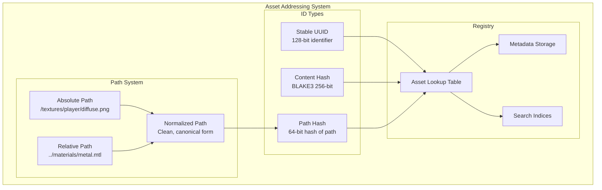
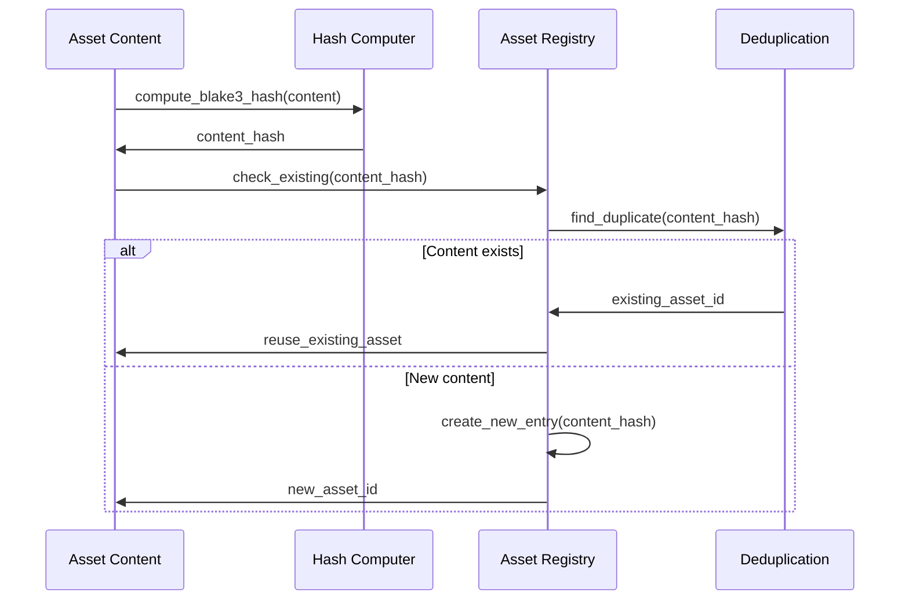
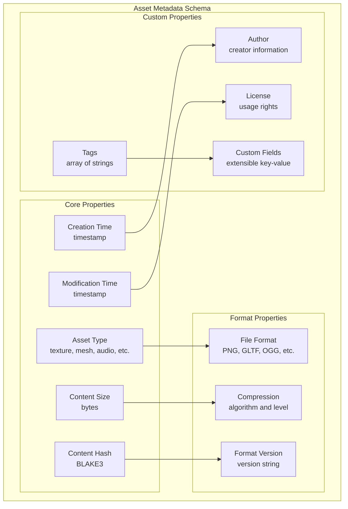

# F.007 - Asset ID and Addressing

## Feature Overview

The Asset ID and Addressing system provides a unified, hierarchical identification scheme for assets within Meta-Graph bundles. This system enables efficient lookup, content-based addressing, and stable references that persist across bundle modifications and platform migrations.

Drawing from the origin story's insight about moving from JSON manifests to graph-based asset management, this feature implements a robust addressing scheme that supports both human-readable paths and cryptographic content hashes.

## Priority
**Critical** - Foundation for asset identification and lookup

## Dependencies
- F.010 - Platform Abstraction (hash computation, string operations)
- F.011 - Error Handling and Validation (parameter validation, error reporting)

## User Stories

### F007.US001 - Hierarchical Asset Paths
**As a** content creator
**I want** human-readable hierarchical asset paths
**So that** I can organize and reference assets intuitively

**Prerequisites:**
- Platform abstraction for string operations (F.010)
- Error handling for validation (F.011)

**Acceptance Criteria:**
- Support Unix-style path syntax (forward slashes)
- Case-sensitive path comparison
- Path normalization and validation
- Support for relative and absolute paths
- Maximum path length enforcement (4096 characters)

### F007.US002 - Content-Based Addressing
**As a** system developer
**I want** content-based asset IDs using cryptographic hashes
**So that** asset integrity can be verified and deduplication is automatic

**Prerequisites:**
- Hash algorithm implementation (BLAKE3)
- Binary data handling

**Acceptance Criteria:**
- BLAKE3 256-bit hashes for content addressing
- Automatic deduplication of identical content
- Tamper detection through hash verification
- Efficient hash computation for large assets
- Hash-based lookup performance optimization

### F007.US003 - Stable Asset References
**As a** system developer
**I want** stable asset IDs that persist across bundle modifications
**So that** references remain valid during development and deployment

**Prerequisites:**
- ID generation and management system

**Acceptance Criteria:**
- UUIDs for stable asset references
- Deterministic ID generation for reproducible builds
- ID persistence across bundle operations
- Reference resolution to current asset versions
- Orphaned reference detection and cleanup

### F007.US004 - Efficient Lookup Operations
**As a** performance engineer
**I want** O(1) average-case asset lookup by ID or path
**So that** asset access is fast even in large bundles

**Prerequisites:**
- Hash table implementation
- String interning system

**Acceptance Criteria:**
- O(1) average lookup by asset ID
- O(log n) lookup by hierarchical path
- Memory-efficient storage of path strings
- Cache-friendly data layout
- Minimal memory overhead per asset

### F007.US005 - Asset Metadata Management
**As a** asset pipeline developer
**I want** to associate metadata with asset IDs
**So that** I can track asset properties, dependencies, and versioning information

**Prerequisites:**
- Metadata storage system
- Serialization support

**Acceptance Criteria:**
- Extensible metadata schema
- Type safety for metadata values
- Efficient metadata queries
- Metadata versioning and migration
- Compact serialization format

## API Design

```c
// Asset ID types
typedef struct {
    uint8_t bytes[32];  // BLAKE3 hash (256 bits)
} mg_content_hash_t;

typedef struct {
    uint64_t high;
    uint64_t low;
} mg_uuid_t;

typedef enum {
    METAGRAPH_ID_TYPE_UUID,
    METAGRAPH_ID_TYPE_CONTENT_HASH,
    METAGRAPH_ID_TYPE_PATH_HASH
} mg_id_type_t;

typedef struct {
    mg_id_type_t type;
    union {
        mg_uuid_t uuid;
        mg_content_hash_t content_hash;
        uint64_t path_hash;
    } id;
} mg_asset_id_t;

// Asset path operations
typedef struct mg_asset_path mg_asset_path_t;

mg_result_t mg_path_create(
    const char* path_string,
    mg_asset_path_t** out_path
);

mg_result_t mg_path_destroy(mg_asset_path_t* path);

mg_result_t mg_path_normalize(
    const char* input_path,
    char* normalized_path,
    size_t buffer_size
);

mg_result_t mg_path_join(
    const mg_asset_path_t* base_path,
    const char* relative_path,
    mg_asset_path_t** out_path
);

mg_result_t mg_path_get_parent(
    const mg_asset_path_t* path,
    mg_asset_path_t** out_parent
);

mg_result_t mg_path_get_filename(
    const mg_asset_path_t* path,
    const char** out_filename
);

mg_result_t mg_path_get_extension(
    const mg_asset_path_t* path,
    const char** out_extension
);

// Asset ID operations
mg_result_t mg_id_create_uuid(mg_asset_id_t* out_id);

mg_result_t mg_id_create_from_content(
    const void* content,
    size_t content_size,
    mg_asset_id_t* out_id
);

mg_result_t mg_id_create_from_path(
    const mg_asset_path_t* path,
    mg_asset_id_t* out_id
);

mg_result_t mg_id_compare(
    const mg_asset_id_t* id1,
    const mg_asset_id_t* id2,
    int* out_result
);

mg_result_t mg_id_to_string(
    const mg_asset_id_t* id,
    char* buffer,
    size_t buffer_size
);

mg_result_t mg_id_from_string(
    const char* id_string,
    mg_asset_id_t* out_id
);

// Asset metadata
typedef enum {
    METAGRAPH_METADATA_TYPE_STRING,
    METAGRAPH_METADATA_TYPE_INTEGER,
    METAGRAPH_METADATA_TYPE_FLOAT,
    METAGRAPH_METADATA_TYPE_BOOLEAN,
    METAGRAPH_METADATA_TYPE_BINARY
} mg_metadata_type_t;

typedef struct {
    mg_metadata_type_t type;
    union {
        const char* string_value;
        int64_t integer_value;
        double float_value;
        bool boolean_value;
        struct {
            const void* data;
            size_t size;
        } binary_value;
    } value;
} mg_metadata_value_t;

typedef struct mg_asset_metadata mg_asset_metadata_t;

mg_result_t mg_metadata_create(mg_asset_metadata_t** out_metadata);
mg_result_t mg_metadata_destroy(mg_asset_metadata_t* metadata);

mg_result_t mg_metadata_set(
    mg_asset_metadata_t* metadata,
    const char* key,
    const mg_metadata_value_t* value
);

mg_result_t mg_metadata_get(
    const mg_asset_metadata_t* metadata,
    const char* key,
    mg_metadata_value_t* out_value
);

mg_result_t mg_metadata_remove(
    mg_asset_metadata_t* metadata,
    const char* key
);

mg_result_t mg_metadata_enumerate(
    const mg_asset_metadata_t* metadata,
    const char*** out_keys,
    size_t* out_count
);

// Asset registry
typedef struct mg_asset_registry mg_asset_registry_t;

mg_result_t mg_registry_create(mg_asset_registry_t** out_registry);
mg_result_t mg_registry_destroy(mg_asset_registry_t* registry);

mg_result_t mg_registry_register_asset(
    mg_asset_registry_t* registry,
    const mg_asset_id_t* asset_id,
    const mg_asset_path_t* path,
    const mg_asset_metadata_t* metadata
);

mg_result_t mg_registry_lookup_by_id(
    const mg_asset_registry_t* registry,
    const mg_asset_id_t* asset_id,
    const mg_asset_path_t** out_path,
    const mg_asset_metadata_t** out_metadata
);

mg_result_t mg_registry_lookup_by_path(
    const mg_asset_registry_t* registry,
    const mg_asset_path_t* path,
    mg_asset_id_t* out_asset_id,
    const mg_asset_metadata_t** out_metadata
);

mg_result_t mg_registry_enumerate_assets(
    const mg_asset_registry_t* registry,
    const char* path_prefix,
    mg_asset_id_t** out_asset_ids,
    size_t* out_count
);
```

## Asset Addressing Architecture



## Lookup Performance Strategy

```mermaid
graph TD
    subgraph "Multi-Level Lookup System"
        subgraph "Primary Index"
            HASH_TABLE[Hash Table<br/>O(1) ID lookup]
            BTREE[B-Tree<br/>O(log n) path lookup]
        end

        subgraph "Secondary Indices"
            TYPE_INDEX[Type Index<br/>Assets by type]
            SIZE_INDEX[Size Index<br/>Assets by size]
            TIME_INDEX[Time Index<br/>Assets by timestamp]
        end

        subgraph "Cache Layer"
            LRU_CACHE[LRU Cache<br/>Recently accessed]
            PATH_CACHE[Path Cache<br/>Resolved paths]
            META_CACHE[Metadata Cache<br/>Frequently used metadata]
        end

        HASH_TABLE --> LRU_CACHE
        BTREE --> PATH_CACHE
        TYPE_INDEX --> META_CACHE

        LRU_CACHE --> |Cache Miss| HASH_TABLE
        PATH_CACHE --> |Cache Miss| BTREE
        META_CACHE --> |Cache Miss| TYPE_INDEX
    end
```

## Content-Based Addressing



## Path Normalization Rules

```c
// Path normalization examples
static const struct {
    const char* input;
    const char* expected;
} normalization_tests[] = {
    // Basic normalization
    {"textures/player/diffuse.png", "textures/player/diffuse.png"},
    {"textures//player//diffuse.png", "textures/player/diffuse.png"},
    {"./textures/player/diffuse.png", "textures/player/diffuse.png"},

    // Parent directory resolution
    {"textures/player/../shared/diffuse.png", "textures/shared/diffuse.png"},
    {"textures/player/../../shared/diffuse.png", "shared/diffuse.png"},

    // Case preservation
    {"Textures/Player/Diffuse.PNG", "Textures/Player/Diffuse.PNG"},

    // Trailing slash removal
    {"textures/player/", "textures/player"},

    // Absolute path handling
    {"/textures/player/diffuse.png", "/textures/player/diffuse.png"},

    // Invalid paths (should fail)
    {"../outside/texture.png", NULL},  // Outside root
    {"", NULL},                        // Empty path
    {"/", "/"}                         // Root path
};
```

## Metadata Schema



## Implementation Notes

### Hash Algorithm Choice
- BLAKE3 provides excellent performance and security
- 256-bit output provides sufficient collision resistance
- Streaming computation for large assets
- Hardware acceleration where available

### UUID Generation
- Version 4 (random) UUIDs for stable references
- Cryptographically secure random number generation
- Deterministic generation for reproducible builds
- Collision detection (extremely unlikely but defensive)

### Path Storage Optimization
- String interning to reduce memory usage
- Trie structure for efficient prefix matching
- Copy-on-write for path modifications
- Memory-mapped storage for large path sets

### Performance Optimizations
- Robin Hood hashing for consistent lookup performance
- Cache-friendly data layout
- Lazy loading of metadata
- Batch operations for bulk updates

## Test Plan

### Unit Tests
1. **Path Operations**
   - Path normalization handles all edge cases
   - Path joining works correctly
   - Parent/filename extraction is accurate
   - Invalid paths are rejected appropriately

2. **ID Generation**
   - UUIDs are unique and well-formed
   - Content hashes are deterministic
   - Path hashes handle collisions gracefully
   - String conversion round-trips correctly

3. **Metadata Management**
   - All metadata types are supported
   - Metadata serialization preserves values
   - Metadata queries work efficiently
   - Memory management is correct

### Integration Tests
1. **Registry Operations**
   - Asset registration and lookup work correctly
   - Duplicate detection prevents redundancy
   - Enumeration returns correct results
   - Concurrent access is thread-safe

2. **Performance Tests**
   - O(1) lookup performance with large datasets
   - Memory usage scales linearly
   - Cache hit rates are acceptable
   - Batch operations are efficient

### Stress Tests
1. **Large Scale**
   - Million+ asset registries perform well
   - Deep path hierarchies work correctly
   - Hash collision handling (synthetic collisions)
   - Memory usage under extreme load

2. **Concurrent Access**
   - Multiple readers scale linearly
   - Reader-writer contention is minimal
   - No race conditions or deadlocks
   - Consistent results under load

## Acceptance Criteria Summary

✅ **Functional Requirements:**
- Human-readable hierarchical paths work intuitively
- Content-based addressing provides integrity verification
- Stable references persist across bundle modifications
- Efficient lookup operations scale to large asset collections
- Rich metadata system supports extensible asset properties

✅ **Performance Requirements:**
- O(1) average-case lookup by asset ID
- O(log n) lookup by hierarchical path
- Memory usage scales linearly with asset count
- Cache-friendly data layout optimizes access patterns

✅ **Quality Requirements:**
- Comprehensive test coverage for all path edge cases
- Hash collision handling (though extremely unlikely)
- Thread safety for concurrent access
- Memory leak detection for all operations

This asset ID and addressing system provides the foundation for efficient, reliable asset identification and lookup that scales from small projects to massive AAA game asset collections.
