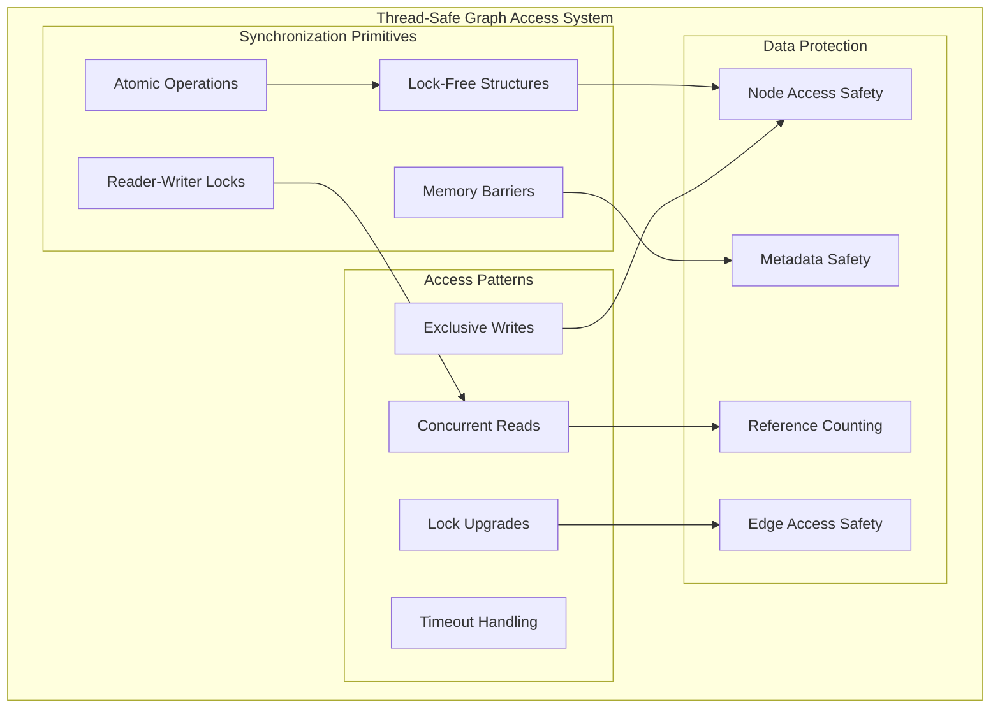
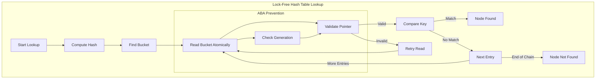
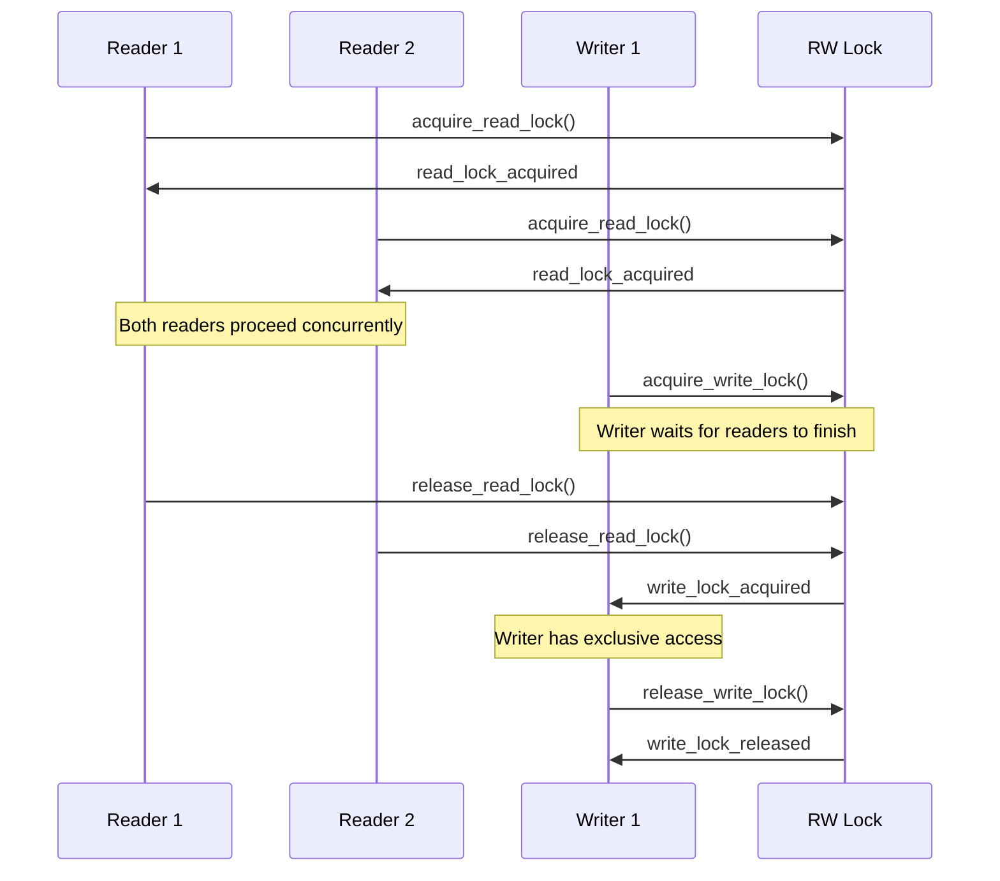
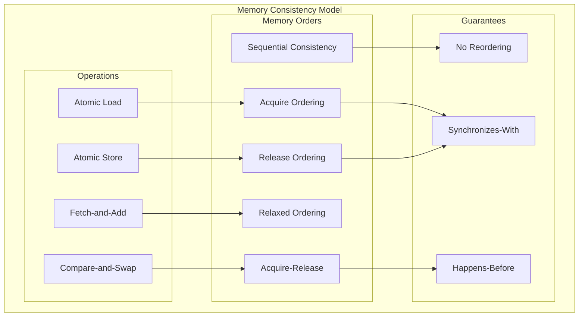

# F.008 - Thread-Safe Graph Access

## Feature Overview

The Thread-Safe Graph Access feature provides safe concurrent access to meta-graph data structures across multiple threads. This feature enables high-performance parallel operations while maintaining data consistency and preventing race conditions, deadlocks, and other concurrency issues.

This feature is essential for realizing the performance potential of modern multi-core systems in asset management workflows, enabling parallel asset loading, concurrent dependency resolution, and thread-safe graph modifications.

## Priority
**High** - Essential for multi-threaded performance

## Dependencies
- F.001 - Core Hypergraph Data Model (graph structures to protect)
- F.010 - Platform Abstraction (threading primitives)
- F.011 - Error Handling and Validation (error reporting, deadlock detection)

## User Stories

### F008.US001 - Concurrent Read Access
**As a** performance engineer
**I want** multiple threads to read graph data simultaneously
**So that** asset lookups can scale with available CPU cores

**Prerequisites:**
- Hypergraph data structures available (F.001)
- Platform threading primitives (F.010)

**Acceptance Criteria:**
- Multiple reader threads can access graph data concurrently
- Read operations do not block each other
- Read performance scales linearly with thread count
- No data races or memory corruption under concurrent access
- Consistent view of graph data during read operations

### F008.US002 - Safe Graph Modifications (Single-Writer Protocol)
**As a** system developer
**I want** thread-safe graph modification operations using single-writer semantics
**So that** assets can be added/removed safely during runtime without writer starvation

**Prerequisites:**
- Thread synchronization primitives
- RCU or epoch-based memory reclamation
- Understanding of single-writer/multiple-reader patterns

**Single-Writer Protocol Specification:**
- **Algorithm Choice**: Ticket-based writer queue with RCU-style memory reclamation
- **Writer Serialization**: Only one writer active at any time via exclusive lock
- **Reader Concurrency**: Multiple readers proceed without blocking writers
- **Memory Reclamation**: Deferred cleanup using epoch-based reclamation
- **Starvation Prevention**: Writer timeout mechanisms with priority escalation
- **Livelock Avoidance**: Exponential backoff for failed CAS operations

**Acceptance Criteria:**
- Graph modifications are atomic and consistent under single-writer constraint
- Writers acquire exclusive access via ticket-based queue (no starvation)
- Readers continue without blocking during writer acquisition
- Memory reclamation is deferred until all readers complete current epoch
- Writer timeout mechanisms prevent indefinite blocking (max 5 seconds)
- Livelock detection triggers exponential backoff with maximum retry limit

### F008.US003 - Lock-Free Read Paths
**As a** performance engineer
**I want** lock-free implementations for read-heavy operations
**So that** high-frequency asset access doesn't suffer from lock contention

**Prerequisites:**
- Atomic operations and memory ordering
- Lock-free data structure expertise

**Acceptance Criteria:**
- Critical read paths use lock-free algorithms
- No blocking for common read operations (node lookup, edge traversal)
- Memory ordering guarantees prevent observing inconsistent state
- ABA problem prevention through appropriate techniques
- Graceful degradation under extreme contention

### F008.US004 - Deadlock Prevention
**As a** reliability engineer
**I want** deadlock detection and prevention mechanisms
**So that** the system remains responsive under all conditions

**Prerequisites:**
- Understanding of deadlock conditions
- Lock ordering and timeout mechanisms

**Acceptance Criteria:**
- Lock acquisition follows consistent ordering to prevent deadlocks
- Timeout mechanisms prevent indefinite blocking
- Deadlock detection provides useful diagnostic information
- Recovery mechanisms handle detected deadlocks gracefully
- Stress testing validates deadlock freedom under load

### F008.US005 - Memory Consistency Guarantees
**As a** system developer
**I want** strong memory consistency guarantees for graph operations
**So that** all threads observe a consistent view of the graph state

**Prerequisites:**
- Memory model understanding for target platforms
- Memory barrier and fence operations

**Acceptance Criteria:**
- All graph operations respect memory ordering requirements
- No torn reads or writes for multi-word data structures
- Memory barriers ensure proper ordering of operations
- Platform-specific memory model differences are handled
- Cache coherency is maintained across all CPU cores

## API Design

```c
// Thread-safe graph handle
typedef struct mg_concurrent_graph mg_concurrent_graph_t;

// Read-write lock for graph operations
typedef enum {
    METAGRAPH_ACCESS_READ,
    METAGRAPH_ACCESS_WRITE,
    METAGRAPH_ACCESS_UPGRADE  // Upgrade read lock to write lock
} mg_access_mode_t;

// Concurrent graph creation and destruction
mg_result_t mg_concurrent_graph_create(
    const mg_graph_config_t* config,
    mg_concurrent_graph_t** out_graph
);

mg_result_t mg_concurrent_graph_destroy(
    mg_concurrent_graph_t* graph
);

// Lock acquisition and release
typedef struct mg_graph_lock mg_graph_lock_t;

mg_result_t mg_graph_acquire_lock(
    mg_concurrent_graph_t* graph,
    mg_access_mode_t mode,
    uint32_t timeout_ms,
    mg_graph_lock_t** out_lock
);

mg_result_t mg_graph_release_lock(
    mg_graph_lock_t* lock
);

mg_result_t mg_graph_upgrade_lock(
    mg_graph_lock_t* lock,
    uint32_t timeout_ms
);

mg_result_t mg_graph_downgrade_lock(
    mg_graph_lock_t* lock
);

// Lock-free read operations
mg_result_t mg_graph_find_node_lockfree(
    const mg_concurrent_graph_t* graph,
    mg_id_t node_id,
    const mg_node_t** out_node
);

mg_result_t mg_graph_get_node_count_lockfree(
    const mg_concurrent_graph_t* graph,
    size_t* out_count
);

mg_result_t mg_graph_enumerate_nodes_lockfree(
    const mg_concurrent_graph_t* graph,
    mg_id_t* node_ids,
    size_t* in_out_count
);

// Thread-safe modification operations
mg_result_t mg_graph_add_node_safe(
    mg_concurrent_graph_t* graph,
    const mg_node_metadata_t* metadata,
    mg_node_t** out_node
);

mg_result_t mg_graph_remove_node_safe(
    mg_concurrent_graph_t* graph,
    mg_id_t node_id
);

mg_result_t mg_graph_add_edge_safe(
    mg_concurrent_graph_t* graph,
    const mg_edge_metadata_t* metadata,
    mg_edge_t** out_edge
);

mg_result_t mg_graph_remove_edge_safe(
    mg_concurrent_graph_t* graph,
    mg_id_t edge_id
);

// Atomic operations for reference counting
typedef struct {
    volatile int count;
} mg_atomic_refcount_t;

mg_result_t mg_refcount_init(
    mg_atomic_refcount_t* refcount,
    int initial_value
);

int mg_refcount_increment(mg_atomic_refcount_t* refcount);
int mg_refcount_decrement(mg_atomic_refcount_t* refcount);
int mg_refcount_get(const mg_atomic_refcount_t* refcount);

// Memory ordering and barriers
typedef enum {
    METAGRAPH_MEMORY_ORDER_RELAXED,
    METAGRAPH_MEMORY_ORDER_ACQUIRE,
    METAGRAPH_MEMORY_ORDER_RELEASE,
    METAGRAPH_MEMORY_ORDER_ACQ_REL,
    METAGRAPH_MEMORY_ORDER_SEQ_CST
} mg_memory_order_t;

void mg_memory_barrier_full(void);
void mg_memory_barrier_read(void);
void mg_memory_barrier_write(void);

// Lock-free data structures
typedef struct mg_lockfree_stack mg_lockfree_stack_t;
typedef struct mg_lockfree_queue mg_lockfree_queue_t;

mg_result_t mg_lockfree_stack_create(
    mg_lockfree_stack_t** out_stack
);

mg_result_t mg_lockfree_stack_destroy(
    mg_lockfree_stack_t* stack
);

mg_result_t mg_lockfree_stack_push(
    mg_lockfree_stack_t* stack,
    void* item
);

mg_result_t mg_lockfree_stack_pop(
    mg_lockfree_stack_t* stack,
    void** out_item
);

// Concurrent hash table for node lookup
typedef struct mg_concurrent_hashtable mg_concurrent_hashtable_t;

mg_result_t mg_concurrent_hashtable_create(
    size_t initial_capacity,
    mg_concurrent_hashtable_t** out_table
);

mg_result_t mg_concurrent_hashtable_destroy(
    mg_concurrent_hashtable_t* table
);

mg_result_t mg_concurrent_hashtable_insert(
    mg_concurrent_hashtable_t* table,
    mg_id_t key,
    void* value
);

mg_result_t mg_concurrent_hashtable_lookup(
    const mg_concurrent_hashtable_t* table,
    mg_id_t key,
    void** out_value
);

mg_result_t mg_concurrent_hashtable_remove(
    mg_concurrent_hashtable_t* table,
    mg_id_t key
);

// Deadlock detection and prevention
typedef struct {
    uint32_t thread_id;
    const char* lock_name;
    uint64_t acquisition_time;
    const char* file;
    int line;
} mg_lock_info_t;

typedef struct {
    mg_lock_info_t* locks_held;
    size_t lock_count;
    uint64_t wait_start_time;
    bool is_waiting;
} mg_thread_lock_state_t;

mg_result_t mg_deadlock_detector_init(void);
mg_result_t mg_deadlock_detector_cleanup(void);

mg_result_t mg_deadlock_register_lock_acquisition(
    const char* lock_name,
    const char* file,
    int line
);

mg_result_t mg_deadlock_register_lock_release(
    const char* lock_name
);

mg_result_t mg_deadlock_check_for_cycles(
    bool* out_deadlock_detected,
    mg_thread_lock_state_t** out_deadlocked_threads,
    size_t* out_thread_count
);

// Performance monitoring
typedef struct {
    uint64_t read_lock_acquisitions;
    uint64_t write_lock_acquisitions;
    uint64_t lock_contentions;
    uint64_t deadlocks_detected;
    uint64_t lockfree_operations;
    double average_lock_hold_time_ms;
    double average_contention_time_ms;
    uint32_t active_readers;
    uint32_t active_writers;
} mg_concurrency_stats_t;

mg_result_t mg_get_concurrency_stats(
    mg_concurrency_stats_t* out_stats
);

mg_result_t mg_reset_concurrency_stats(void);

// Thread-local storage for optimization
typedef struct mg_thread_context mg_thread_context_t;

mg_result_t mg_thread_context_create(
    mg_thread_context_t** out_context
);

mg_result_t mg_thread_context_destroy(
    mg_thread_context_t* context
);

mg_result_t mg_thread_context_get_current(
    mg_thread_context_t** out_context
);
```

## Thread-Safe Architecture



## Lock-Free Node Lookup



## Reader-Writer Lock Implementation



## Memory Ordering and Consistency



## Implementation Notes

### Reader-Writer Lock Optimization
- Use ticket-based fair reader-writer locks to prevent writer starvation
- Implement reader preference for read-heavy workloads
- Support lock upgrades (read to write) to reduce lock cycling
- Use atomic operations for lock state to minimize overhead

### Lock-Free Data Structures
- Implement hazard pointers or epochs for safe memory reclamation
- Use generation counters to prevent ABA problems
- Design for cache-line alignment to reduce false sharing
- Implement backoff strategies for high contention scenarios

### Memory Model Considerations
- Use appropriate memory ordering for each operation type
- Implement memory barriers for platforms with weak memory models
- Consider platform-specific optimizations (x86 vs ARM memory models)
- Validate memory ordering with thread sanitizer and stress testing

### Deadlock Prevention Strategies
- Establish global lock ordering to prevent circular dependencies
- Use timeout-based lock acquisition to prevent indefinite blocking
- Implement deadlock detection with cycle detection in wait-for graphs
- Provide diagnostic information for deadlock debugging

## Test Plan

### Unit Tests
1. **Basic Synchronization**
   - Reader-writer locks work correctly under various access patterns
   - Atomic operations provide expected guarantees
   - Memory barriers prevent reordering where required
   - Reference counting prevents use-after-free

2. **Lock-Free Operations**
   - Lock-free structures maintain consistency under contention
   - ABA problem prevention works correctly
   - Memory reclamation doesn't cause crashes
   - Performance is better than locked alternatives

3. **Error Conditions**
   - Timeout mechanisms work correctly
   - Deadlock detection identifies real deadlocks
   - Error recovery maintains system consistency
   - Resource cleanup works under all conditions

### Concurrency Tests
1. **Stress Testing**
   - High contention scenarios (many threads, hot data)
   - Long-running tests (hours/days) for race condition detection
   - Memory pressure testing for allocation/deallocation races
   - Platform-specific testing (different CPU architectures)

2. **Correctness Validation**
   - Thread sanitizer integration for race detection
   - Helgrind/DRD for deadlock and race detection
   - Litmus testing for memory model validation
   - Formal verification where possible

### Performance Tests
1. **Scalability**
   - Read performance scales with thread count
   - Write performance degrades gracefully under contention
   - Lock-free operations outperform locked alternatives
   - Memory usage remains bounded under load

2. **Real-World Scenarios**
   - Asset loading with realistic access patterns
   - Build system dependency resolution under concurrency
   - Live service hot-reload scenarios
   - Large graph traversal with concurrent modifications

## Acceptance Criteria Summary

✅ **Functional Requirements:**
- Multiple threads can safely read graph data concurrently
- Graph modifications are atomic and consistent
- Lock-free read paths provide high performance
- Deadlock detection prevents system hangs
- Strong memory consistency guarantees prevent data corruption

✅ **Performance Requirements:**
- Read operations scale linearly with thread count
- Lock contention overhead is minimized
- Lock-free operations achieve better performance than locked versions
- Memory overhead for synchronization is acceptable (<10% of base graph size)

✅ **Reliability Requirements:**
- No data races under any access pattern
- Deadlock detection and prevention work correctly
- System remains responsive under extreme load
- Memory safety is maintained under all concurrency scenarios

This thread-safe graph access system provides the concurrency foundation that enables Meta-Graph to scale efficiently across multiple CPU cores while maintaining data integrity and system reliability.
