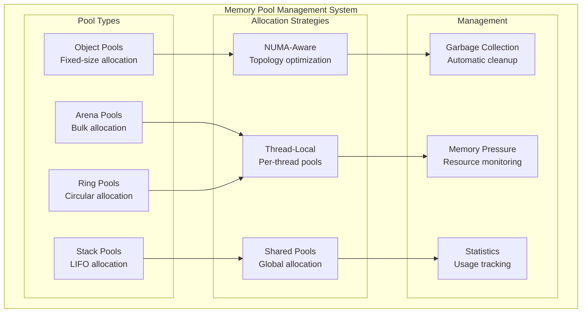
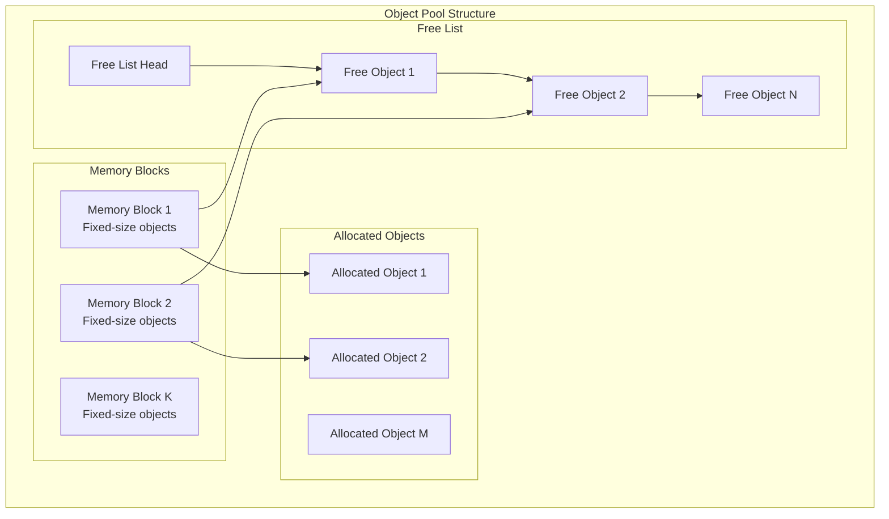
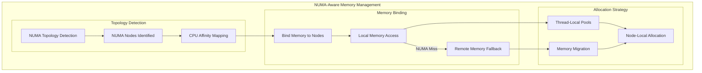
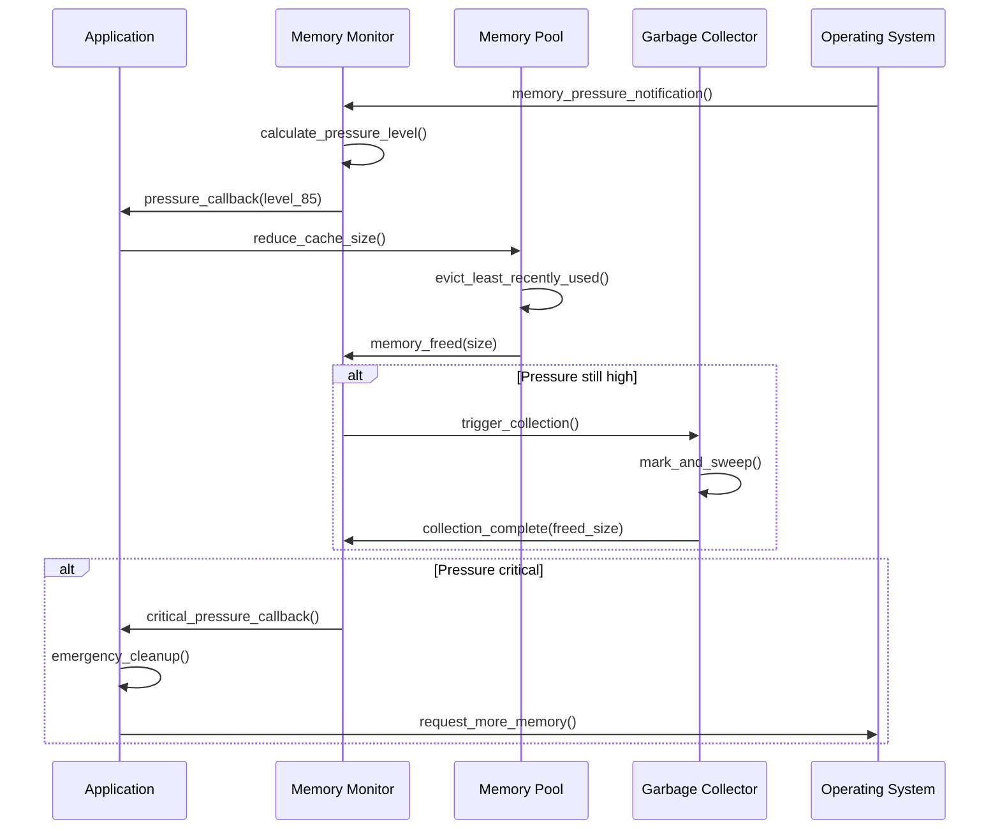

# F.009 - Memory Pool Management

## Feature Overview

The Memory Pool Management feature provides efficient, predictable memory allocation strategies optimized for meta-graph operations. This feature implements custom memory allocators that reduce fragmentation, improve cache locality, and provide deterministic performance for asset management workflows.

Building on the insight from the origin story about the importance of memory-mapped I/O and efficient binary formats, this feature ensures that memory management doesn't become a bottleneck in high-performance asset processing.

## Priority
**High** - Essential for performance and memory efficiency

## Dependencies
- F.010 - Platform Abstraction (memory allocation primitives)
- F.011 - Error Handling and Validation (error reporting, bounds checking)

## User Stories

### F009.US001 - Object Pool Allocation
**As a** performance engineer
**I want** object pools for frequently allocated/deallocated structures
**So that** allocation overhead doesn't impact performance

**Prerequisites:**
- Platform memory allocation primitives (F.010)
- Understanding of object lifecycle patterns

**Acceptance Criteria:**
- Object pools for nodes, edges, and metadata structures
- O(1) allocation and deallocation performance
- Configurable pool sizes and growth policies
- Automatic pool expansion when needed
- Memory usage statistics and monitoring

### F009.US002 - Arena-Based Allocation
**As a** system developer
**I want** arena allocators for bulk memory management
**So that** related objects are allocated together for better cache locality

**Prerequisites:**
- Large memory block management
- Understanding of memory layout optimization

**Acceptance Criteria:**
- Arena allocators for graph construction and traversal
- Configurable arena sizes and alignment requirements
- Efficient arena cleanup and reset operations
- Memory fragmentation minimization
- Support for different allocation strategies within arenas

### F009.US003 - NUMA-Aware Allocation
**As a** platform engineer
**I want** NUMA-aware memory allocation
**So that** multi-socket systems achieve optimal performance

**Prerequisites:**
- NUMA topology detection (F.010)
- Understanding of NUMA memory access patterns

**Acceptance Criteria:**
- Automatic NUMA node detection and memory binding
- Thread-local allocation from appropriate NUMA nodes
- Memory migration support for load balancing
- NUMA-aware graph partitioning strategies
- Performance monitoring for NUMA efficiency

### F009.US004 - Memory Pressure Handling
**As a** reliability engineer
**I want** graceful handling of memory pressure conditions
**So that** the system remains stable under resource constraints

**Prerequisites:**
- Memory pressure detection mechanisms
- Graceful degradation strategies

**Acceptance Criteria:**
- Automatic detection of low memory conditions
- Configurable memory usage limits and thresholds
- Graceful degradation through cache eviction
- Emergency memory reclamation mechanisms
- Proper error reporting for out-of-memory conditions

### F009.US005 - Garbage Collection and Cleanup
**As a** system developer
**I want** deterministic memory cleanup and garbage collection
**So that** long-running applications don't suffer from memory leaks

**Prerequisites:**
- Reference counting or ownership tracking
- Safe memory reclamation mechanisms

**Acceptance Criteria:**
- Automatic cleanup of unreferenced objects
- Configurable garbage collection policies
- Deterministic cleanup timing (no unpredictable pauses)
- Memory leak detection and reporting
- Support for manual memory management where needed

## API Design

```c
// Memory pool types
typedef enum {
    METAGRAPH_POOL_TYPE_OBJECT,     // Fixed-size object pools
    METAGRAPH_POOL_TYPE_ARENA,      // Arena-based allocation
    METAGRAPH_POOL_TYPE_STACK,      // Stack-based allocation
    METAGRAPH_POOL_TYPE_RING        // Ring buffer allocation
} mg_pool_type_t;

// Memory pool configuration
typedef struct {
    mg_pool_type_t type;
    size_t initial_size;           // Initial pool size in bytes
    size_t max_size;               // Maximum pool size (0 = unlimited)
    size_t alignment;              // Memory alignment requirement
    size_t object_size;            // Size for object pools
    bool allow_growth;             // Whether pool can grow
    bool numa_aware;               // Enable NUMA awareness
    uint32_t numa_node;            // Preferred NUMA node
} mg_pool_config_t;

// Memory pool handle
typedef struct mg_memory_pool mg_memory_pool_t;

// Pool creation and destruction
mg_result_t mg_memory_pool_create(
    const mg_pool_config_t* config,
    mg_memory_pool_t** out_pool
);

mg_result_t mg_memory_pool_destroy(
    mg_memory_pool_t* pool
);

// Memory allocation and deallocation
mg_result_t mg_memory_pool_alloc(
    mg_memory_pool_t* pool,
    size_t size,
    void** out_ptr
);

mg_result_t mg_memory_pool_free(
    mg_memory_pool_t* pool,
    void* ptr
);

mg_result_t mg_memory_pool_aligned_alloc(
    mg_memory_pool_t* pool,
    size_t size,
    size_t alignment,
    void** out_ptr
);

// Object pool operations
mg_result_t mg_object_pool_acquire(
    mg_memory_pool_t* pool,
    void** out_object
);

mg_result_t mg_object_pool_release(
    mg_memory_pool_t* pool,
    void* object
);

// Arena operations
mg_result_t mg_arena_reset(
    mg_memory_pool_t* arena
);

mg_result_t mg_arena_checkpoint(
    mg_memory_pool_t* arena,
    void** out_checkpoint
);

mg_result_t mg_arena_restore(
    mg_memory_pool_t* arena,
    void* checkpoint
);

// NUMA-aware allocation
typedef struct {
    uint32_t node_count;           // Number of NUMA nodes
    uint32_t* node_ids;            // NUMA node identifiers
    size_t* node_memory_sizes;     // Available memory per node
    uint32_t* cpu_counts;          // CPU count per node
} mg_numa_topology_t;

mg_result_t mg_get_numa_topology(
    mg_numa_topology_t* out_topology
);

mg_result_t mg_memory_pool_bind_numa(
    mg_memory_pool_t* pool,
    uint32_t numa_node
);

mg_result_t mg_memory_pool_get_numa_node(
    const mg_memory_pool_t* pool,
    uint32_t* out_numa_node
);

// Memory pressure monitoring
typedef struct {
    uint64_t total_allocated;      // Total memory allocated
    uint64_t total_available;      // Total memory available
    uint64_t pool_allocated;       // Memory allocated by pools
    uint64_t pool_wasted;          // Fragmented/wasted memory
    double fragmentation_ratio;    // Fragmentation percentage
    uint32_t pressure_level;       // 0-100 pressure indicator
} mg_memory_status_t;

mg_result_t mg_get_memory_status(
    mg_memory_status_t* out_status
);

typedef void (*mg_memory_pressure_callback_t)(
    uint32_t pressure_level,
    const mg_memory_status_t* status,
    void* user_data
);

mg_result_t mg_register_memory_pressure_callback(
    mg_memory_pressure_callback_t callback,
    void* user_data
);

// Garbage collection
typedef enum {
    METAGRAPH_GC_POLICY_NONE,       // Manual memory management only
    METAGRAPH_GC_POLICY_REFERENCE,  // Reference counting
    METAGRAPH_GC_POLICY_MARK_SWEEP, // Mark and sweep
    METAGRAPH_GC_POLICY_GENERATIONAL // Generational collection
} mg_gc_policy_t;

typedef struct {
    mg_gc_policy_t policy;
    uint32_t collection_threshold; // Collection trigger threshold
    uint32_t max_pause_time_ms;    // Maximum collection pause time
    bool incremental;              // Enable incremental collection
    bool concurrent;               // Enable concurrent collection
} mg_gc_config_t;

mg_result_t mg_gc_configure(
    const mg_gc_config_t* config
);

mg_result_t mg_gc_collect(
    bool force_full_collection
);

mg_result_t mg_gc_add_root(
    void* root_object,
    size_t object_size
);

mg_result_t mg_gc_remove_root(
    void* root_object
);

// Memory pool statistics
typedef struct {
    size_t total_size;             // Total pool size
    size_t allocated_size;         // Currently allocated
    size_t free_size;              // Available for allocation
    size_t largest_free_block;     // Largest contiguous free block
    uint32_t allocation_count;     // Number of allocations
    uint32_t deallocation_count;   // Number of deallocations
    uint32_t growth_count;         // Number of pool expansions
    double fragmentation_ratio;    // Internal fragmentation
    double utilization_ratio;      // Memory utilization
} mg_pool_stats_t;

mg_result_t mg_memory_pool_get_stats(
    const mg_memory_pool_t* pool,
    mg_pool_stats_t* out_stats
);

mg_result_t mg_memory_pool_reset_stats(
    mg_memory_pool_t* pool
);

// Memory debugging and validation
#ifdef METAGRAPH_DEBUG_MEMORY
typedef struct {
    void* address;
    size_t size;
    const char* file;
    int line;
    uint64_t timestamp;
    uint32_t thread_id;
} mg_allocation_info_t;

mg_result_t mg_memory_debug_enable(void);
mg_result_t mg_memory_debug_disable(void);

mg_result_t mg_memory_debug_get_allocations(
    mg_allocation_info_t** out_allocations,
    size_t* out_count
);

mg_result_t mg_memory_debug_check_leaks(
    bool* out_leaks_detected
);
#endif

// Thread-local pools
typedef struct mg_thread_local_pool mg_thread_local_pool_t;

mg_result_t mg_thread_local_pool_create(
    const mg_pool_config_t* config,
    mg_thread_local_pool_t** out_pool
);

mg_result_t mg_thread_local_pool_destroy(
    mg_thread_local_pool_t* pool
);

mg_result_t mg_thread_local_alloc(
    size_t size,
    void** out_ptr
);

mg_result_t mg_thread_local_free(
    void* ptr
);
```

## Memory Pool Architecture



## Object Pool Implementation



## NUMA-Aware Allocation Strategy



## Memory Pressure Handling



## Implementation Notes

### Object Pool Optimization
- Use lock-free stacks for thread-safe object pools
- Implement per-thread caches to reduce contention
- Pre-allocate common object sizes based on usage patterns
- Use memory alignment to optimize cache line usage

### Arena Allocation Strategy
- Implement bump pointer allocation for fast allocation
- Support nested arena scopes with checkpoint/restore
- Use virtual memory for large arenas with on-demand commitment
- Implement arena defragmentation for long-running processes

### NUMA Considerations
- Detect NUMA topology at startup and cache topology information
- Bind threads to NUMA nodes based on workload characteristics
- Implement memory migration for load balancing
- Monitor NUMA memory access patterns for optimization

### Garbage Collection Design
- Use generational collection for better performance
- Implement incremental collection to minimize pause times
- Support concurrent collection on platforms with good memory models
- Provide tuning parameters for different workload patterns

## Test Plan

### Unit Tests
1. **Basic Pool Operations**
   - Object allocation and deallocation work correctly
   - Arena reset and checkpoint/restore functionality
   - Pool growth and shrinkage under various conditions
   - Thread-local pool isolation and performance

2. **Memory Management**
   - No memory leaks under normal operation
   - Proper cleanup during pool destruction
   - Alignment requirements are respected
   - Out-of-memory conditions handled gracefully

3. **NUMA Functionality**
   - NUMA topology detection works correctly
   - Memory binding affects allocation patterns
   - Performance benefits on NUMA systems
   - Graceful fallback on non-NUMA systems

### Performance Tests
1. **Allocation Performance**
   - Object pool allocation faster than malloc/free
   - Arena allocation provides bulk allocation benefits
   - Thread-local pools reduce contention
   - NUMA-aware allocation improves performance

2. **Memory Efficiency**
   - Low fragmentation under typical workloads
   - Memory utilization efficiency
   - Garbage collection overhead is acceptable
   - Memory pressure handling maintains performance

### Stress Tests
1. **High Load Scenarios**
   - Sustained high allocation/deallocation rates
   - Memory pressure under extreme conditions
   - Concurrent access from many threads
   - Long-running processes without memory growth

2. **Resource Exhaustion**
   - Behavior under out-of-memory conditions
   - Recovery from memory pressure
   - Garbage collection under extreme load
   - System stability during resource exhaustion

## Acceptance Criteria Summary

✅ **Functional Requirements:**
- Object pools provide O(1) allocation/deallocation
- Arena allocators offer efficient bulk memory management
- NUMA-aware allocation optimizes for multi-socket systems
- Memory pressure handling maintains system stability
- Garbage collection prevents memory leaks in long-running processes

✅ **Performance Requirements:**
- Object pool allocation 5-10x faster than system malloc
- Arena allocation reduces memory fragmentation significantly
- NUMA-aware allocation shows measurable performance improvement
- Memory overhead for pool management <5% of allocated memory

✅ **Quality Requirements:**
- No memory leaks under any usage pattern
- Thread safety for all concurrent operations
- Stress testing validates performance under extreme load
- Memory debugging tools help identify usage issues

This memory pool management system provides the efficient, predictable memory allocation foundation that enables Meta-Graph to maintain high performance even under demanding workloads and resource constraints.
