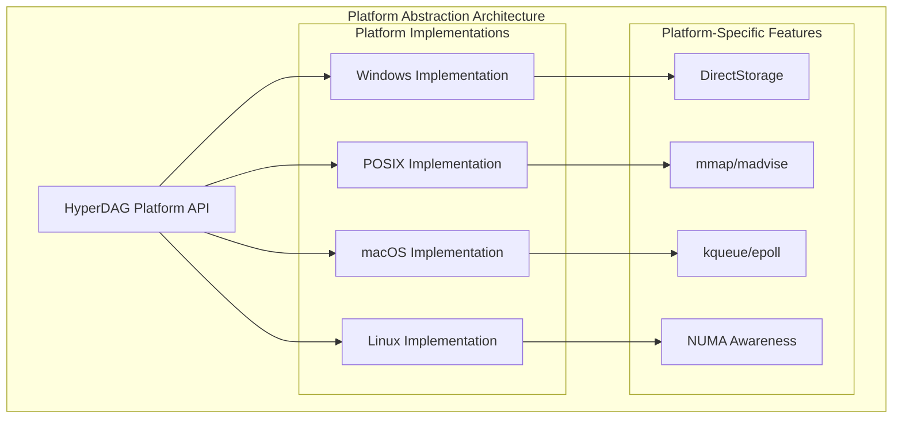
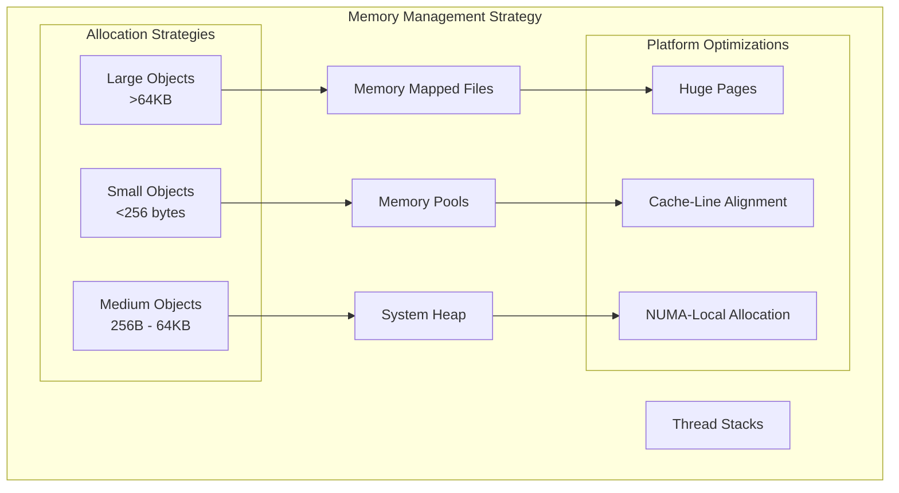

# F.010 - Platform Abstraction

## Feature Overview

The Platform Abstraction layer provides a unified interface for platform-specific operations across Windows, macOS, Linux, and other target platforms. This layer isolates HyperDAG's core algorithms from platform differences in file I/O, memory management, threading, and system calls.

This is the foundational layer that enables HyperDAG to maintain a single codebase while leveraging platform-specific optimizations like DirectStorage on Windows, hardware acceleration on PlayStation 5, and memory mapping strategies across different operating systems.

## Priority
**Foundation** - Required by all other features

## Dependencies
None - This is the base layer

## User Stories

### F010.US001 - Cross-Platform File I/O
**As a** system developer  
**I want** unified file I/O operations across platforms  
**So that** HyperDAG can load bundles consistently regardless of operating system  

**Prerequisites:**
- None (foundation layer)

**Acceptance Criteria:**
- Single API for file open, read, write, close operations
- Handles platform-specific file path conventions
- Supports both synchronous and asynchronous I/O
- Error codes are platform-independent
- Large file support (>4GB) on all platforms

### F010.US002 - Memory Management Abstraction
**As a** system developer  
**I want** platform-neutral memory allocation primitives  
**So that** memory management is consistent and optimized per platform  

**Prerequisites:**
- Understanding of target platform memory models

**Acceptance Criteria:**
- Unified malloc/free interface with platform optimizations
- Memory mapping support where available
- Alignment guarantees for SIMD operations
- Virtual memory management for large allocations
- Memory pressure monitoring and callbacks

### F010.US003 - Threading Primitives
**As a** system developer  
**I want** cross-platform threading and synchronization  
**So that** HyperDAG can leverage multicore systems safely  

**Prerequisites:**
- Platform threading model understanding

**Acceptance Criteria:**
- Thread creation, destruction, and management
- Mutex, semaphore, and condition variable support
- Atomic operations for lock-free programming
- Thread-local storage abstraction
- CPU core count detection and affinity setting

### F010.US004 - System Information Access
**As a** performance engineer  
**I want** to query system capabilities and resources  
**So that** HyperDAG can optimize behavior for the target hardware  

**Prerequisites:**
- Platform capability detection mechanisms

**Acceptance Criteria:**
- CPU information (cores, cache sizes, instruction sets)
- Memory information (total, available, page sizes)
- Storage information (type, capabilities, performance)
- Platform identification and version detection
- Hardware acceleration capability detection

### F010.US005 - High-Resolution Timing
**As a** performance engineer  
**I want** accurate timing and profiling capabilities  
**So that** performance can be measured and optimized consistently  

**Prerequisites:**
- Platform high-resolution timer access

**Acceptance Criteria:**
- Nanosecond precision timing where available
- Monotonic clock access for reliable intervals
- CPU cycle counter access for micro-benchmarking
- Platform-independent time representation
- Overhead measurement for timing operations

## API Design

```c
// Platform initialization
typedef struct {
    bool enable_large_pages;
    bool enable_numa_awareness;
    size_t thread_pool_size;
    const char* temp_directory;
} hyperdag_platform_config_t;

hyperdag_result_t hyperdag_platform_init(const hyperdag_platform_config_t* config);
hyperdag_result_t hyperdag_platform_cleanup(void);

// File I/O abstraction
typedef struct hyperdag_file hyperdag_file_t;

typedef enum {
    HYPERDAG_FILE_READ = 1,
    HYPERDAG_FILE_WRITE = 2,
    HYPERDAG_FILE_CREATE = 4,
    HYPERDAG_FILE_EXCLUSIVE = 8
} hyperdag_file_flags_t;

hyperdag_result_t hyperdag_file_open(
    const char* path,
    hyperdag_file_flags_t flags,
    hyperdag_file_t** out_file
);

hyperdag_result_t hyperdag_file_close(hyperdag_file_t* file);

hyperdag_result_t hyperdag_file_read(
    hyperdag_file_t* file,
    void* buffer,
    size_t size,
    size_t* bytes_read
);

hyperdag_result_t hyperdag_file_write(
    hyperdag_file_t* file,
    const void* buffer,
    size_t size,
    size_t* bytes_written
);

hyperdag_result_t hyperdag_file_seek(
    hyperdag_file_t* file,
    int64_t offset,
    int whence
);

hyperdag_result_t hyperdag_file_get_size(
    hyperdag_file_t* file,
    uint64_t* out_size
);

// Memory mapping
typedef struct {
    void* address;
    size_t size;
    bool is_writable;
} hyperdag_memory_map_t;

hyperdag_result_t hyperdag_file_map_memory(
    hyperdag_file_t* file,
    uint64_t offset,
    size_t size,
    bool writable,
    hyperdag_memory_map_t* out_map
);

hyperdag_result_t hyperdag_memory_unmap(hyperdag_memory_map_t* map);

// Memory allocation
hyperdag_result_t hyperdag_malloc(size_t size, void** out_ptr);
hyperdag_result_t hyperdag_free(void* ptr);
hyperdag_result_t hyperdag_aligned_malloc(size_t size, size_t alignment, void** out_ptr);
hyperdag_result_t hyperdag_realloc(void* ptr, size_t new_size, void** out_ptr);

// Threading
typedef struct hyperdag_thread hyperdag_thread_t;
typedef struct hyperdag_mutex hyperdag_mutex_t;
typedef struct hyperdag_condition hyperdag_condition_t;

typedef void* (*hyperdag_thread_func_t)(void* arg);

hyperdag_result_t hyperdag_thread_create(
    hyperdag_thread_func_t func,
    void* arg,
    hyperdag_thread_t** out_thread
);

hyperdag_result_t hyperdag_thread_join(hyperdag_thread_t* thread, void** out_result);
hyperdag_result_t hyperdag_thread_detach(hyperdag_thread_t* thread);

hyperdag_result_t hyperdag_mutex_create(hyperdag_mutex_t** out_mutex);
hyperdag_result_t hyperdag_mutex_destroy(hyperdag_mutex_t* mutex);
hyperdag_result_t hyperdag_mutex_lock(hyperdag_mutex_t* mutex);
hyperdag_result_t hyperdag_mutex_unlock(hyperdag_mutex_t* mutex);
hyperdag_result_t hyperdag_mutex_trylock(hyperdag_mutex_t* mutex);

// Atomic operations
typedef struct { volatile int value; } hyperdag_atomic_int_t;
typedef struct { volatile void* value; } hyperdag_atomic_ptr_t;

int hyperdag_atomic_load_int(const hyperdag_atomic_int_t* atomic);
void hyperdag_atomic_store_int(hyperdag_atomic_int_t* atomic, int value);
int hyperdag_atomic_exchange_int(hyperdag_atomic_int_t* atomic, int value);
bool hyperdag_atomic_compare_exchange_int(
    hyperdag_atomic_int_t* atomic,
    int* expected,
    int desired
);

// System information
typedef struct {
    uint32_t cpu_count;
    uint32_t cache_line_size;
    uint64_t total_memory;
    uint64_t available_memory;
    uint32_t page_size;
    bool has_sse;
    bool has_avx;
    bool has_avx512;
} hyperdag_system_info_t;

hyperdag_result_t hyperdag_get_system_info(hyperdag_system_info_t* out_info);

// High-resolution timing
typedef struct {
    uint64_t ticks;
    uint64_t frequency;
} hyperdag_timestamp_t;

hyperdag_result_t hyperdag_get_timestamp(hyperdag_timestamp_t* out_timestamp);
double hyperdag_timestamp_to_seconds(const hyperdag_timestamp_t* timestamp);
```

## Platform-Specific Implementation Strategy



## Platform-Specific Optimizations

### Windows
```c
#ifdef HYPERDAG_PLATFORM_WINDOWS
// Use DirectStorage for high-performance I/O
typedef struct {
    ID3D12Device* device;
    DSTORAGE_FACTORY* dstorage_factory;
    DSTORAGE_QUEUE* dstorage_queue;
} windows_platform_data_t;

hyperdag_result_t hyperdag_windows_enable_directstorage(
    ID3D12Device* device
);
#endif
```

### Linux
```c
#ifdef HYPERDAG_PLATFORM_LINUX
// Use io_uring for async I/O
typedef struct {
    struct io_uring ring;
    int ring_fd;
    void* ring_mem;
} linux_platform_data_t;

hyperdag_result_t hyperdag_linux_init_io_uring(void);
#endif
```

### macOS
```c
#ifdef HYPERDAG_PLATFORM_MACOS
// Use kqueue for event notification
typedef struct {
    int kqueue_fd;
    struct kevent* events;
    size_t event_count;
} macos_platform_data_t;

hyperdag_result_t hyperdag_macos_init_kqueue(void);
#endif
```

## Memory Layout and Management



## Implementation Notes

### File I/O Strategy
- Use native async I/O APIs where available (io_uring, IOCP, kqueue)
- Implement sync I/O as fallback for compatibility
- Buffer management to minimize system calls
- Direct I/O for large sequential reads to bypass filesystem cache

### Memory Management
- Separate allocators for different size classes
- NUMA-aware allocation on multi-socket systems
- Cache-line alignment for frequently accessed structures
- Memory pressure monitoring to trigger garbage collection

### Threading Model
- Thread pool with work-stealing queues
- Lock-free data structures where possible
- Atomic operations with appropriate memory ordering
- Thread affinity for performance-critical paths

## Test Plan

### Unit Tests
1. **File I/O Operations**
   - Open, read, write, close operations work correctly
   - Large file support (>4GB files)
   - Error handling for invalid operations
   - Path handling across different platforms

2. **Memory Operations**
   - Allocation and deallocation without leaks
   - Alignment guarantees are met
   - Memory mapping works correctly
   - Out-of-memory handling

3. **Threading**
   - Thread creation and destruction
   - Mutex operations work correctly
   - Atomic operations have correct semantics
   - No race conditions or deadlocks

### Platform Tests
1. **Windows Specific**
   - DirectStorage integration works
   - Windows file path handling
   - IOCP async operations

2. **Linux Specific**
   - io_uring functionality
   - epoll event handling
   - NUMA awareness

3. **macOS Specific**
   - kqueue operations
   - macOS-specific file attributes
   - Grand Central Dispatch integration

### Performance Tests
1. **I/O Performance**
   - Sequential read/write throughput
   - Random access performance
   - Async vs sync I/O comparison

2. **Memory Performance**
   - Allocation/deallocation overhead
   - Memory mapping vs copying
   - Cache miss rates

3. **Threading Performance**
   - Thread creation overhead
   - Lock contention under load
   - Atomic operation performance

## Acceptance Criteria Summary

✅ **Functional Requirements:**
- Single API works across all target platforms
- Platform-specific optimizations can be enabled
- All operations have consistent error handling
- Large file and memory support works correctly
- Threading primitives are safe and efficient

✅ **Performance Requirements:**
- Platform-native performance for I/O operations
- Memory operations are cache-friendly
- Threading overhead is minimal
- Atomic operations use optimal instructions

✅ **Quality Requirements:**
- Comprehensive test coverage for all platforms
- Memory leak detection passes on all platforms
- Thread safety validation with stress testing
- Performance benchmarks for optimization tracking

This platform abstraction layer provides the foundation that enables HyperDAG to achieve high performance while maintaining portability across diverse target platforms.