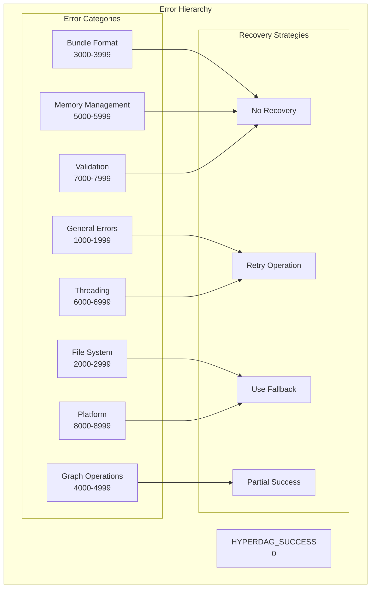
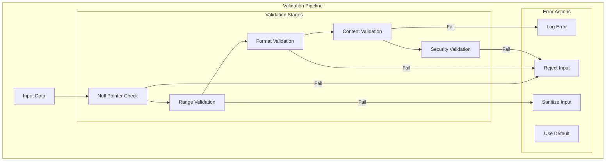
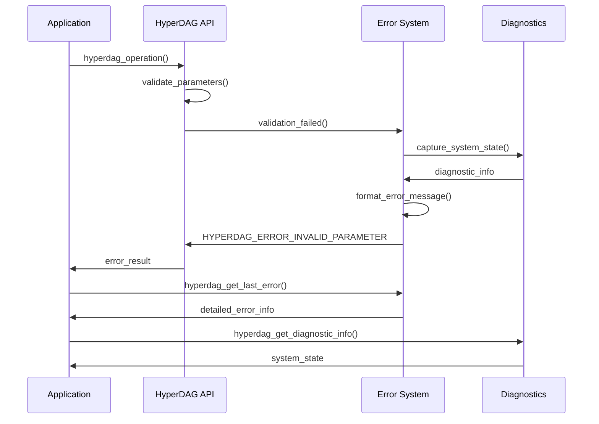

# F.011 - Error Handling and Validation

## Feature Overview

The Error Handling and Validation system provides comprehensive, structured error reporting and data validation throughout HyperDAG. This system enables robust error recovery, detailed diagnostics, and defensive programming practices that ensure reliability in production environments.

Following C23 best practices, this feature implements a result-based error handling model that makes error conditions explicit and provides rich context for debugging and monitoring.

## Priority
**Foundation** - Required by all other features

## Dependencies
None - This is a base layer alongside platform abstraction

## User Stories

### F011.US001 - Structured Error Reporting
**As a** system developer  
**I want** structured error codes with detailed context  
**So that** I can handle errors appropriately and provide useful diagnostics  

**Prerequisites:**
- None (foundation layer)

**Acceptance Criteria:**
- Hierarchical error codes with categories and subcategories
- Rich error context with file, line, function information
- Error message formatting with parameters
- Stack trace capture where available
- Thread-safe error reporting

### F011.US002 - Result Type System
**As a** library integrator  
**I want** explicit success/failure return types  
**So that** error conditions cannot be accidentally ignored  

**Prerequisites:**
- C23 compiler support for modern features

**Acceptance Criteria:**
- All functions return result types, not void
- Success/failure is explicit and cannot be ignored
- Error propagation is straightforward
- Resource cleanup is guaranteed on errors
- No silent failures or undefined behavior

### F011.US003 - Data Validation Framework
**As a** security engineer  
**I want** comprehensive input validation  
**So that** invalid data is caught early and security vulnerabilities are prevented  

**Prerequisites:**
- Understanding of data validation requirements

**Acceptance Criteria:**
- Validation of all external inputs (files, parameters)
- Range checking for numeric values
- Null pointer and buffer overflow protection
- Format validation for structured data
- Sanitization of user-provided strings

### F011.US004 - Diagnostic Information Collection
**As a** support engineer  
**I want** detailed diagnostic information when errors occur  
**So that** I can quickly identify and resolve issues  

**Prerequisites:**
- Platform abstraction for system information

**Acceptance Criteria:**
- System state capture on critical errors
- Memory usage and resource tracking
- Operation context and call history
- Performance metrics at time of error
- Reproducible error scenarios

### F011.US005 - Error Recovery Mechanisms
**As a** system developer  
**I want** structured error recovery options  
**So that** applications can gracefully handle failures without crashing  

**Prerequisites:**
- Error categorization system

**Acceptance Criteria:**
- Recoverable vs non-recoverable error classification
- Automatic retry mechanisms for transient failures
- Graceful degradation options
- Resource cleanup on all error paths
- User-configurable error handling policies

## API Design

```c
// Core result type
typedef enum {
    HYPERDAG_SUCCESS = 0,
    
    // General errors (1000-1999)
    HYPERDAG_ERROR_INVALID_PARAMETER = 1000,
    HYPERDAG_ERROR_OUT_OF_MEMORY = 1001,
    HYPERDAG_ERROR_NOT_INITIALIZED = 1002,
    HYPERDAG_ERROR_ALREADY_INITIALIZED = 1003,
    HYPERDAG_ERROR_INVALID_STATE = 1004,
    HYPERDAG_ERROR_OPERATION_FAILED = 1005,
    HYPERDAG_ERROR_NOT_IMPLEMENTED = 1006,
    HYPERDAG_ERROR_TIMEOUT = 1007,
    
    // File system errors (2000-2999)
    HYPERDAG_ERROR_FILE_NOT_FOUND = 2000,
    HYPERDAG_ERROR_FILE_ACCESS_DENIED = 2001,
    HYPERDAG_ERROR_FILE_CORRUPTED = 2002,
    HYPERDAG_ERROR_FILE_TOO_LARGE = 2003,
    HYPERDAG_ERROR_INVALID_PATH = 2004,
    HYPERDAG_ERROR_DISK_FULL = 2005,
    HYPERDAG_ERROR_IO_ERROR = 2006,
    
    // Bundle format errors (3000-3999)
    HYPERDAG_ERROR_INVALID_BUNDLE = 3000,
    HYPERDAG_ERROR_BUNDLE_VERSION_MISMATCH = 3001,
    HYPERDAG_ERROR_BUNDLE_CORRUPTED = 3002,
    HYPERDAG_ERROR_BUNDLE_SIGNATURE_INVALID = 3003,
    HYPERDAG_ERROR_BUNDLE_TOO_OLD = 3004,
    HYPERDAG_ERROR_BUNDLE_TOO_NEW = 3005,
    HYPERDAG_ERROR_BUNDLE_INCOMPLETE = 3006,
    
    // Graph errors (4000-4999)
    HYPERDAG_ERROR_NODE_NOT_FOUND = 4000,
    HYPERDAG_ERROR_EDGE_NOT_FOUND = 4001,
    HYPERDAG_ERROR_CIRCULAR_DEPENDENCY = 4002,
    HYPERDAG_ERROR_INVALID_GRAPH_STATE = 4003,
    HYPERDAG_ERROR_GRAPH_TOO_LARGE = 4004,
    HYPERDAG_ERROR_DUPLICATE_NODE = 4005,
    
    // Memory errors (5000-5999)
    HYPERDAG_ERROR_ALLOCATION_FAILED = 5000,
    HYPERDAG_ERROR_BUFFER_OVERFLOW = 5001,
    HYPERDAG_ERROR_INVALID_POINTER = 5002,
    HYPERDAG_ERROR_MEMORY_CORRUPTION = 5003,
    HYPERDAG_ERROR_MEMORY_LEAK = 5004,
    
    // Threading errors (6000-6999)
    HYPERDAG_ERROR_THREAD_CREATE_FAILED = 6000,
    HYPERDAG_ERROR_MUTEX_LOCK_FAILED = 6001,
    HYPERDAG_ERROR_DEADLOCK_DETECTED = 6002,
    HYPERDAG_ERROR_RACE_CONDITION = 6003,
    
    // Validation errors (7000-7999)
    HYPERDAG_ERROR_INVALID_FORMAT = 7000,
    HYPERDAG_ERROR_CHECKSUM_MISMATCH = 7001,
    HYPERDAG_ERROR_SIZE_MISMATCH = 7002,
    HYPERDAG_ERROR_TYPE_MISMATCH = 7003,
    HYPERDAG_ERROR_RANGE_ERROR = 7004,
    
    // Platform errors (8000-8999)
    HYPERDAG_ERROR_PLATFORM_UNSUPPORTED = 8000,
    HYPERDAG_ERROR_FEATURE_UNAVAILABLE = 8001,
    HYPERDAG_ERROR_PERMISSION_DENIED = 8002,
    HYPERDAG_ERROR_RESOURCE_BUSY = 8003
} hyperdag_result_t;

// Error information structure
typedef struct {
    hyperdag_result_t code;
    const char* message;
    const char* function;
    const char* file;
    int line;
    uint64_t timestamp;
    uint32_t thread_id;
    void* context;
    size_t context_size;
} hyperdag_error_info_t;

// Error handling functions
const char* hyperdag_error_string(hyperdag_result_t result);
const hyperdag_error_info_t* hyperdag_get_last_error(void);
void hyperdag_clear_last_error(void);

// Error reporting macros
#define HYPERDAG_RETURN_ERROR(code, msg, ...) \
    do { \
        hyperdag_set_error((code), __func__, __FILE__, __LINE__, (msg), ##__VA_ARGS__); \
        return (code); \
    } while(0)

#define HYPERDAG_CHECK(expr) \
    do { \
        hyperdag_result_t _result = (expr); \
        if (_result != HYPERDAG_SUCCESS) { \
            hyperdag_propagate_error(_result, __func__, __FILE__, __LINE__); \
            return _result; \
        } \
    } while(0)

#define HYPERDAG_VALIDATE(condition, error_code, msg, ...) \
    do { \
        if (!(condition)) { \
            HYPERDAG_RETURN_ERROR((error_code), (msg), ##__VA_ARGS__); \
        } \
    } while(0)

// Validation functions
hyperdag_result_t hyperdag_validate_pointer(const void* ptr, const char* name);
hyperdag_result_t hyperdag_validate_buffer(const void* buffer, size_t size, const char* name);
hyperdag_result_t hyperdag_validate_string(const char* str, size_t max_length, const char* name);
hyperdag_result_t hyperdag_validate_range_size_t(size_t value, size_t min, size_t max, const char* name);
hyperdag_result_t hyperdag_validate_range_uint32(uint32_t value, uint32_t min, uint32_t max, const char* name);

// Advanced validation
typedef struct {
    bool allow_null;
    size_t min_size;
    size_t max_size;
    bool require_alignment;
    size_t alignment;
} hyperdag_buffer_validation_t;

hyperdag_result_t hyperdag_validate_buffer_advanced(
    const void* buffer,
    size_t size,
    const hyperdag_buffer_validation_t* rules,
    const char* name
);

// Error context management
typedef struct hyperdag_error_context hyperdag_error_context_t;

hyperdag_result_t hyperdag_error_context_create(hyperdag_error_context_t** out_context);
hyperdag_result_t hyperdag_error_context_destroy(hyperdag_error_context_t* context);
hyperdag_result_t hyperdag_error_context_add_info(
    hyperdag_error_context_t* context,
    const char* key,
    const char* value
);

// Diagnostic information
typedef struct {
    uint64_t total_memory_used;
    uint64_t peak_memory_used;
    uint32_t active_threads;
    uint32_t open_files;
    uint32_t loaded_bundles;
    double cpu_usage_percent;
    uint64_t error_count;
    hyperdag_result_t last_error;
} hyperdag_diagnostic_info_t;

hyperdag_result_t hyperdag_get_diagnostic_info(hyperdag_diagnostic_info_t* out_info);

// Error recovery
typedef enum {
    HYPERDAG_RECOVERY_NONE,     // No recovery possible
    HYPERDAG_RECOVERY_RETRY,    // Operation can be retried
    HYPERDAG_RECOVERY_FALLBACK, // Alternative approach available
    HYPERDAG_RECOVERY_PARTIAL   // Partial success possible
} hyperdag_recovery_strategy_t;

typedef struct {
    hyperdag_recovery_strategy_t strategy;
    uint32_t max_retries;
    uint32_t retry_delay_ms;
    bool log_retries;
} hyperdag_recovery_config_t;

hyperdag_recovery_strategy_t hyperdag_get_recovery_strategy(hyperdag_result_t error);
hyperdag_result_t hyperdag_configure_recovery(const hyperdag_recovery_config_t* config);
```

## Error Categorization System



## Validation Framework



## Error Context and Diagnostics



## Implementation Notes

### Error Code Design
- Use ranges to categorize errors logically
- Reserve space for future error types in each category
- Provide both numeric codes and string descriptions
- Support localization for error messages

### Thread Safety
- Thread-local storage for error context
- Atomic operations for global error counters
- Lock-free error reporting where possible
- Careful ordering for error state updates

### Performance Considerations
- Minimal overhead in success path
- Lazy evaluation of error context
- Efficient string formatting
- Avoid allocations in error paths

### Memory Management
- Static storage for error strings where possible
- Careful cleanup of error context on thread exit
- Bounded memory usage for error tracking
- No allocations in out-of-memory error handling

## Test Plan

### Unit Tests
1. **Error Code Functionality**
   - All error codes have string representations
   - Error macros work correctly
   - Error propagation maintains context
   - Thread-local error storage works

2. **Validation Functions**
   - Null pointer validation catches errors
   - Range validation works for all numeric types
   - Buffer validation prevents overflows
   - String validation handles edge cases

3. **Recovery Mechanisms**
   - Recovery strategies are correctly assigned
   - Retry logic works with exponential backoff
   - Fallback mechanisms are triggered appropriately
   - Resource cleanup occurs on all error paths

### Integration Tests
1. **Error Propagation**
   - Errors propagate correctly through call stack
   - Context information is preserved
   - No memory leaks in error paths
   - Thread safety under concurrent errors

2. **Diagnostic Collection**
   - System state is captured accurately
   - Performance impact is minimal
   - Diagnostic information is useful for debugging
   - No interference with normal operations

### Stress Tests
1. **High Error Rate**
   - System remains stable under high error rates
   - Memory usage remains bounded
   - Performance degrades gracefully
   - No deadlocks or race conditions

2. **Resource Exhaustion**
   - Handles out-of-memory conditions gracefully
   - File handle exhaustion is managed
   - Thread exhaustion doesn't cause crashes
   - Recovery works when resources become available

## Acceptance Criteria Summary

✅ **Functional Requirements:**
- Comprehensive error codes for all failure modes
- Rich error context with debugging information
- Robust validation prevents invalid operations
- Recovery mechanisms handle transient failures
- Thread-safe error handling across all operations

✅ **Performance Requirements:**
- Minimal overhead in success paths
- Error handling doesn't allocate memory unnecessarily
- Diagnostic collection has bounded performance impact
- Error reporting scales with system size

✅ **Quality Requirements:**
- Complete test coverage for all error paths
- Memory leak detection for error scenarios
- Stress testing validates robustness
- Documentation covers error handling patterns

This error handling and validation system provides the robust foundation that enables HyperDAG to maintain reliability and provide excellent debugging experiences in production environments.