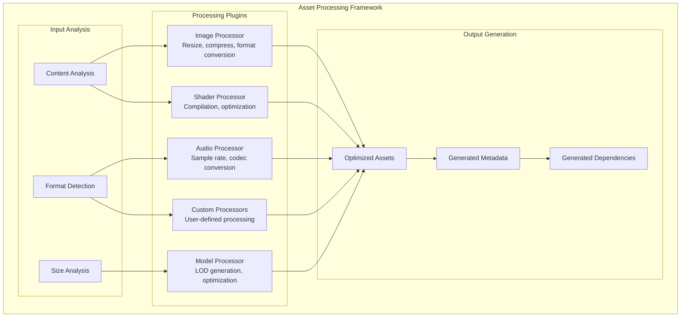
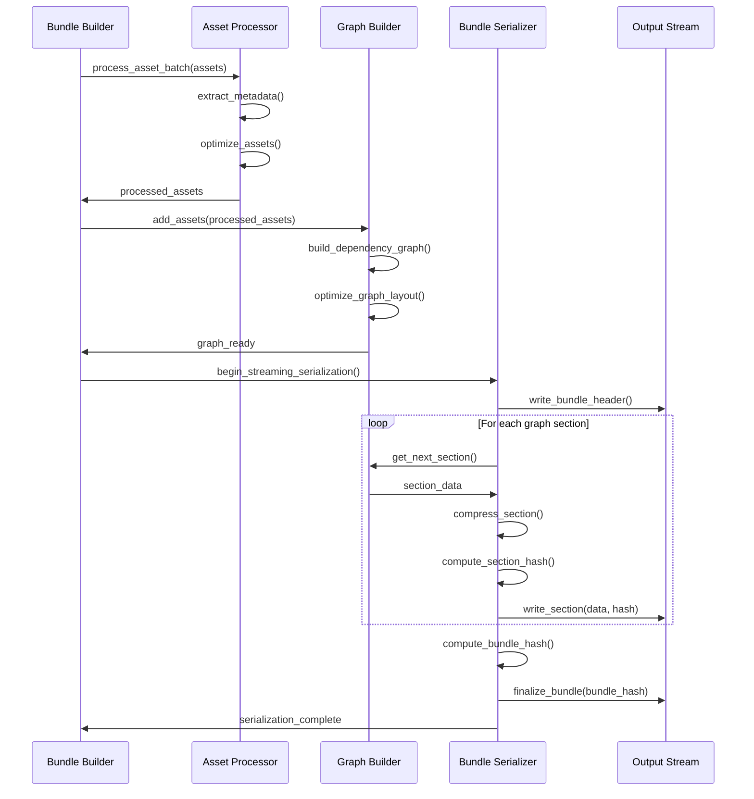

# F.012 - Bundle Creation and Serialization

## Feature Overview

The Bundle Creation and Serialization feature provides a comprehensive builder API for constructing HyperDAG bundles from assets and dependency information. This feature implements the final piece of the asset pipeline, transforming in-memory graph structures into the optimized binary format described in the origin story.

This feature serves as the bridge between asset creation tools and the runtime HyperDAG system, enabling the creation of production-ready bundles that leverage all the performance and integrity features of the core system.

## Priority
**High** - Essential for practical bundle creation

## Dependencies
- F.001 - Core Hypergraph Data Model (graph structures to serialize)
- F.002 - Binary Bundle Format (target serialization format)
- F.004 - BLAKE3 Cryptographic Integrity (integrity computation)
- F.006 - Dependency Resolution Algorithm (dependency ordering)
- F.011 - Error Handling and Validation (error reporting, validation)

## User Stories

### F012.US001 - Bundle Builder Interface
**As a** build system developer  
**I want** a fluent builder API for creating bundles  
**So that** I can programmatically construct bundles from various asset sources  

**Prerequisites:**
- Core hypergraph data structures (F.001)
- Binary bundle format specification (F.002)

**Acceptance Criteria:**
- Fluent builder API with method chaining
- Support for adding assets from files, memory, and streams
- Automatic dependency detection and validation
- Configuration options for compression and optimization
- Progress reporting for large bundle creation

### F012.US002 - Asset Import and Processing
**As a** content pipeline developer  
**I want** automatic asset import with metadata extraction  
**So that** assets are properly categorized and optimized during bundle creation  

**Prerequisites:**
- Asset type detection capabilities
- Metadata extraction for various file formats

**Acceptance Criteria:**
- Automatic asset type detection from file extensions and content
- Metadata extraction for common asset formats (images, audio, 3D models)
- Asset validation and optimization during import
- Custom asset processors through plugin interface
- Batch processing for large asset collections

### F012.US003 - Dependency Analysis and Optimization
**As a** performance engineer  
**I want** automatic dependency analysis and bundle optimization  
**So that** bundles are structured for optimal loading performance  

**Prerequisites:**
- Dependency resolution algorithms (F.006)
- Understanding of optimal bundle organization

**Acceptance Criteria:**
- Automatic dependency discovery from asset content
- Dependency conflict detection and resolution
- Bundle optimization for access patterns and locality
- Dead asset elimination and tree shaking
- Performance estimation and reporting

### F012.US004 - Streaming Bundle Generation
**As a** build system developer  
**I want** streaming bundle generation for large asset collections  
**So that** memory usage remains bounded during bundle creation  

**Prerequisites:**
- Streaming I/O capabilities
- Memory-efficient processing algorithms

**Acceptance Criteria:**
- Constant memory usage regardless of bundle size
- Streaming input from various sources (files, databases, networks)
- Incremental bundle writing with progress tracking
- Resume capability for interrupted builds
- Parallel processing where possible

### F012.US005 - Bundle Validation and Verification
**As a** quality assurance engineer  
**I want** comprehensive bundle validation before deployment  
**So that** only correct and optimized bundles reach production  

**Prerequisites:**
- Bundle integrity verification (F.004)
- Comprehensive validation rules

**Acceptance Criteria:**
- Complete bundle integrity verification using BLAKE3
- Dependency consistency validation
- Performance characteristic analysis
- Asset format validation and compatibility checking
- Detailed validation reports with actionable recommendations

## API Design

```c
// Bundle builder handle
typedef struct hyperdag_bundle_builder hyperdag_bundle_builder_t;

// Builder configuration
typedef struct {
    uint32_t format_version;       // Bundle format version
    uint32_t compression_level;    // 0-9 compression level
    bool optimize_for_streaming;   // Optimize for streaming access
    bool optimize_for_random;      // Optimize for random access
    bool enable_deduplication;     // Enable content deduplication
    bool validate_dependencies;    // Validate dependency consistency
    size_t max_memory_usage;       // Maximum memory usage during build
    const char* temp_directory;    // Temporary file directory
} hyperdag_builder_config_t;

// Bundle builder creation and destruction
hyperdag_result_t hyperdag_bundle_builder_create(
    const hyperdag_builder_config_t* config,
    hyperdag_bundle_builder_t** out_builder
);

hyperdag_result_t hyperdag_bundle_builder_destroy(
    hyperdag_bundle_builder_t* builder
);

// Asset addition methods
hyperdag_result_t hyperdag_builder_add_asset_from_file(
    hyperdag_bundle_builder_t* builder,
    const char* file_path,
    const char* asset_path,
    hyperdag_asset_id_t* out_asset_id
);

hyperdag_result_t hyperdag_builder_add_asset_from_memory(
    hyperdag_bundle_builder_t* builder,
    const void* data,
    size_t data_size,
    const char* asset_path,
    const hyperdag_asset_metadata_t* metadata,
    hyperdag_asset_id_t* out_asset_id
);

hyperdag_result_t hyperdag_builder_add_asset_from_stream(
    hyperdag_bundle_builder_t* builder,
    hyperdag_file_t* stream,
    const char* asset_path,
    const hyperdag_asset_metadata_t* metadata,
    hyperdag_asset_id_t* out_asset_id
);

// Directory and batch processing
hyperdag_result_t hyperdag_builder_add_directory(
    hyperdag_bundle_builder_t* builder,
    const char* directory_path,
    const char* base_asset_path,
    bool recursive
);

hyperdag_result_t hyperdag_builder_add_asset_list(
    hyperdag_bundle_builder_t* builder,
    const char** file_paths,
    const char** asset_paths,
    size_t count
);

// Dependency management
hyperdag_result_t hyperdag_builder_add_dependency(
    hyperdag_bundle_builder_t* builder,
    hyperdag_asset_id_t from_asset,
    hyperdag_asset_id_t to_asset,
    uint32_t dependency_type
);

hyperdag_result_t hyperdag_builder_remove_dependency(
    hyperdag_bundle_builder_t* builder,
    hyperdag_asset_id_t from_asset,
    hyperdag_asset_id_t to_asset
);

hyperdag_result_t hyperdag_builder_auto_detect_dependencies(
    hyperdag_bundle_builder_t* builder,
    bool enable_content_analysis
);

// Asset processing and optimization
typedef struct {
    const char* name;
    const char* version;
    const char** input_extensions;
    const char** output_extensions;
    
    hyperdag_result_t (*process)(
        const void* input_data,
        size_t input_size,
        const hyperdag_asset_metadata_t* input_metadata,
        void** output_data,
        size_t* output_size,
        hyperdag_asset_metadata_t** output_metadata
    );
} hyperdag_asset_processor_t;

hyperdag_result_t hyperdag_builder_register_processor(
    hyperdag_bundle_builder_t* builder,
    const hyperdag_asset_processor_t* processor
);

hyperdag_result_t hyperdag_builder_process_assets(
    hyperdag_bundle_builder_t* builder,
    const char* processor_name,
    const char** asset_patterns,
    size_t pattern_count
);

// Bundle optimization
typedef struct {
    bool eliminate_unused_assets;   // Remove unreferenced assets
    bool optimize_asset_order;      // Optimize asset loading order
    bool merge_small_assets;        // Merge small assets for efficiency
    bool compress_assets;           // Apply asset-specific compression
    uint32_t target_chunk_size;     // Target chunk size for optimization
} hyperdag_optimization_config_t;

hyperdag_result_t hyperdag_builder_optimize(
    hyperdag_bundle_builder_t* builder,
    const hyperdag_optimization_config_t* config
);

// Progress monitoring
typedef struct {
    uint64_t assets_processed;      // Number of assets processed
    uint64_t total_assets;          // Total number of assets
    uint64_t bytes_processed;       // Bytes processed so far
    uint64_t total_bytes;           // Total bytes to process
    double completion_percentage;   // Completion percentage (0-100)
    const char* current_operation;  // Current operation description
} hyperdag_build_progress_t;

typedef void (*hyperdag_progress_callback_t)(
    const hyperdag_build_progress_t* progress,
    void* user_data
);

hyperdag_result_t hyperdag_builder_set_progress_callback(
    hyperdag_bundle_builder_t* builder,
    hyperdag_progress_callback_t callback,
    void* user_data
);

// Bundle generation
hyperdag_result_t hyperdag_builder_build_to_file(
    hyperdag_bundle_builder_t* builder,
    const char* output_path
);

hyperdag_result_t hyperdag_builder_build_to_stream(
    hyperdag_bundle_builder_t* builder,
    hyperdag_file_t* output_stream
);

hyperdag_result_t hyperdag_builder_build_to_memory(
    hyperdag_bundle_builder_t* builder,
    void** out_data,
    size_t* out_size
);

// Validation and analysis
typedef struct {
    uint64_t total_assets;          // Total number of assets
    uint64_t total_dependencies;    // Total number of dependencies
    uint64_t circular_dependencies; // Number of circular dependencies
    uint64_t unreferenced_assets;   // Number of unreferenced assets
    uint64_t duplicate_assets;      // Number of duplicate assets
    uint64_t compressed_size;       // Compressed bundle size
    uint64_t uncompressed_size;     // Uncompressed bundle size
    double compression_ratio;       // Compression ratio achieved
    uint32_t max_dependency_depth;  // Maximum dependency depth
    double estimated_load_time_ms;  // Estimated loading time
} hyperdag_bundle_analysis_t;

hyperdag_result_t hyperdag_builder_analyze(
    const hyperdag_bundle_builder_t* builder,
    hyperdag_bundle_analysis_t* out_analysis
);

hyperdag_result_t hyperdag_builder_validate(
    const hyperdag_bundle_builder_t* builder,
    uint32_t validation_flags
);

// Validation flags
#define HYPERDAG_VALIDATE_DEPENDENCIES  (1 << 0)
#define HYPERDAG_VALIDATE_ASSETS         (1 << 1)
#define HYPERDAG_VALIDATE_METADATA       (1 << 2)
#define HYPERDAG_VALIDATE_PERFORMANCE    (1 << 3)
#define HYPERDAG_VALIDATE_INTEGRITY      (1 << 4)
#define HYPERDAG_VALIDATE_ALL            (0xFFFFFFFF)

// Asset metadata extraction
typedef struct {
    uint32_t width, height;         // Image dimensions
    uint32_t channels;              // Number of color channels
    const char* format;             // Format string (PNG, JPEG, etc.)
    uint32_t bit_depth;             // Bits per channel
    bool has_alpha;                 // Whether image has alpha channel
} hyperdag_image_metadata_t;

typedef struct {
    uint32_t sample_rate;           // Audio sample rate
    uint32_t channels;              // Number of audio channels
    uint32_t bit_depth;             // Bits per sample
    double duration_seconds;        // Audio duration
    const char* format;             // Format string (WAV, OGG, etc.)
    const char* codec;              // Codec used
} hyperdag_audio_metadata_t;

typedef struct {
    uint32_t vertex_count;          // Number of vertices
    uint32_t face_count;            // Number of faces
    uint32_t material_count;        // Number of materials
    bool has_normals;               // Whether model has normals
    bool has_texcoords;             // Whether model has texture coordinates
    const char* format;             // Format string (GLTF, FBX, etc.)
} hyperdag_model_metadata_t;

hyperdag_result_t hyperdag_extract_image_metadata(
    const void* image_data,
    size_t data_size,
    hyperdag_image_metadata_t* out_metadata
);

hyperdag_result_t hyperdag_extract_audio_metadata(
    const void* audio_data,
    size_t data_size,
    hyperdag_audio_metadata_t* out_metadata
);

hyperdag_result_t hyperdag_extract_model_metadata(
    const void* model_data,
    size_t data_size,
    hyperdag_model_metadata_t* out_metadata
);

// Incremental building
typedef struct hyperdag_incremental_context hyperdag_incremental_context_t;

hyperdag_result_t hyperdag_incremental_context_create(
    const char* cache_directory,
    hyperdag_incremental_context_t** out_context
);

hyperdag_result_t hyperdag_incremental_context_destroy(
    hyperdag_incremental_context_t* context
);

hyperdag_result_t hyperdag_builder_enable_incremental(
    hyperdag_bundle_builder_t* builder,
    hyperdag_incremental_context_t* context
);

hyperdag_result_t hyperdag_builder_check_changes(
    hyperdag_bundle_builder_t* builder,
    bool* out_has_changes
);
```

## Bundle Creation Pipeline

```mermaid
graph TD
    subgraph "Bundle Creation Pipeline"
        subgraph "Input Processing"
            FILES[Asset Files]
            DIRS[Directory Scanning]
            STREAMS[Data Streams]
            MEMORY[Memory Buffers]
        end
        
        subgraph "Asset Processing"
            DETECT[Type Detection]
            METADATA[Metadata Extraction]
            PROCESS[Asset Processing]
            VALIDATE[Asset Validation]
        end
        
        subgraph "Graph Construction"
            ADD_ASSETS[Add Assets to Graph]
            DEPS[Dependency Analysis]
            RESOLVE[Dependency Resolution]
            OPTIMIZE[Graph Optimization]
        end
        
        subgraph "Serialization"
            LAYOUT[Memory Layout]
            COMPRESS[Compression]
            INTEGRITY[Integrity Hashes]
            OUTPUT[Bundle Output]
        end
        
        FILES --> DETECT
        DIRS --> DETECT
        STREAMS --> DETECT
        MEMORY --> DETECT
        
        DETECT --> METADATA
        METADATA --> PROCESS
        PROCESS --> VALIDATE
        
        VALIDATE --> ADD_ASSETS
        ADD_ASSETS --> DEPS
        DEPS --> RESOLVE
        RESOLVE --> OPTIMIZE
        
        OPTIMIZE --> LAYOUT
        LAYOUT --> COMPRESS
        COMPRESS --> INTEGRITY
        INTEGRITY --> OUTPUT
    end
```



## Asset Processing Framework



## Streaming Bundle Generation



## Implementation Notes

### Asset Type Detection
- Use file extension as primary hint
- Implement content-based detection for ambiguous cases
- Support custom type registration through plugin interface
- Cache detection results for performance

### Dependency Discovery
- Parse asset content for references (texture paths, shader includes, etc.)
- Use heuristics for implicit dependencies
- Support manual dependency specification
- Validate dependency consistency during build

### Memory Management
- Use streaming algorithms to keep memory usage constant
- Implement temporary file usage for large intermediate data
- Support resume capability for interrupted builds
- Provide memory usage monitoring and limits

### Performance Optimization
- Parallelize independent asset processing
- Use incremental building to avoid redundant work
- Implement asset caching based on content hashes
- Optimize bundle layout for target access patterns

## Test Plan

### Unit Tests
1. **Builder Operations**
   - Asset addition from various sources works correctly
   - Dependency management functions properly
   - Bundle configuration affects output correctly
   - Error handling for invalid inputs

2. **Asset Processing**
   - Metadata extraction for all supported formats
   - Asset processors transform content correctly
   - Validation catches format errors and corruption
   - Custom processors integrate properly

3. **Serialization**
   - Generated bundles load correctly in runtime
   - Streaming generation produces identical results
   - Compression and optimization work as expected
   - Integrity verification passes for all bundles

### Integration Tests
1. **Real-World Scenarios**
   - Game asset pipeline integration
   - Large-scale bundle generation (10K+ assets)
   - Incremental build scenarios
   - Cross-platform bundle compatibility

2. **Performance Tests**
   - Build time scales reasonably with asset count
   - Memory usage remains bounded for large builds
   - Parallel processing provides expected speedup
   - Incremental builds are significantly faster

### Stress Tests
1. **Extreme Scenarios**
   - Massive asset collections (100K+ assets)
   - Deep dependency hierarchies
   - Complex dependency graphs with cycles
   - Memory pressure during building

2. **Error Recovery**
   - Handling of corrupted input assets
   - Recovery from disk space exhaustion
   - Graceful handling of process interruption
   - Validation of error reporting accuracy

## Acceptance Criteria Summary

✅ **Functional Requirements:**
- Fluent builder API enables easy bundle construction
- Automatic asset import with metadata extraction
- Dependency analysis and optimization work correctly
- Streaming generation handles arbitrarily large bundles
- Comprehensive validation ensures bundle quality

✅ **Performance Requirements:**
- Build time scales linearly with asset count
- Memory usage remains constant regardless of bundle size
- Parallel processing achieves near-linear speedup
- Incremental builds provide 5-10x speedup for changed assets

✅ **Quality Requirements:**
- Generated bundles pass all integrity checks
- Asset processing maintains quality and compatibility
- Error handling provides actionable diagnostic information
- Documentation enables easy integration into build systems

This bundle creation and serialization system completes the HyperDAG pipeline, enabling the transformation of raw assets into optimized, integrity-verified bundles that leverage all the performance and reliability features of the core system.