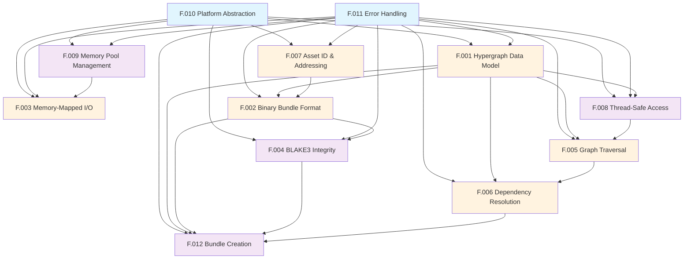

# Meta-Graph Core Features

This directory contains the complete feature specification for Meta-Graph - the mathematical core that provides the foundation for TurtlGraph and other graph-based asset management systems.

## Feature Overview

| Feature ID | Name | Priority | Dependencies |
|------------|------|----------|--------------|
| [F.001](F001-core-meta-graph-data-model.md) | Core Hypergraph Data Model | Critical | F.010, F.011 |
| [F.002](F002-binary-bundle-format.md) | Binary Bundle Format | Critical | F.001, F.007, F.011 |
| [F.003](F003-memory-mapped-io-operations.md) | Memory-Mapped I/O Operations | Critical | F.010, F.009, F.011 |
| [F.004](F004-blake3-cryptographic-integrity.md) | BLAKE3 Cryptographic Integrity | High | F.002, F.010, F.011 |
| [F.005](F005-graph-traversal-engine.md) | Graph Traversal Engine | Critical | F.001, F.008, F.011 |
| [F.006](F006-dependency-resolution-algorithm.md) | Dependency Resolution Algorithm | Critical | F.001, F.005, F.011 |
| [F.007](F007-asset-id-and-addressing.md) | Asset ID and Addressing | Critical | F.010, F.011 |
| [F.008](F008-thread-safe-graph-access.md) | Thread-Safe Graph Access | High | F.001, F.010, F.011 |
| [F.009](F009-memory-pool-management.md) | Memory Pool Management | High | F.010, F.011 |
| [F.010](F010-platform-abstraction.md) | Platform Abstraction | Foundation | None |
| [F.011](F011-error-handling-validation.md) | Error Handling and Validation | Foundation | None |
| [F.012](F012-bundle-creation-serialization.md) | Bundle Creation and Serialization | High | F.001, F.002, F.004, F.006, F.011 |

## Implementation Roadmap

### Phase 1: Foundation (Weeks 1-2)
- F.010 - Platform Abstraction
- F.011 - Error Handling and Validation

### Phase 2: Core Data Structures (Weeks 3-4)
- F.001 - Core Hypergraph Data Model
- F.007 - Asset ID and Addressing
- F.009 - Memory Pool Management

### Phase 3: I/O and Serialization (Weeks 5-6)
- F.002 - Binary Bundle Format
- F.003 - Memory-Mapped I/O Operations
- F.004 - BLAKE3 Cryptographic Integrity

### Phase 4: Algorithms and Concurrency (Weeks 7-8)
- F.005 - Graph Traversal Engine
- F.008 - Thread-Safe Graph Access
- F.006 - Dependency Resolution Algorithm

### Phase 5: Builder and Integration (Week 9)
- F.012 - Bundle Creation and Serialization

## Feature Dependencies

## Meta-Graph vs TurtlGraph Boundary

### Meta-Graph Responsibilities
- Mathematical meta-graph data structures
- Binary serialization and deserialization
- Memory-mapped I/O operations
- Cryptographic integrity verification
- Core graph algorithms (traversal, dependency resolution)
- Platform abstraction (basic file I/O, threading, memory)
- Thread-safe concurrent access primitives
- Error handling and validation

### TurtlGraph Builds Upon Meta-Graph
- Streaming and prefetching systems
- Platform-specific optimizations (DirectStorage, PS5, mobile)
- CDN integration and delta patching
- Hot reload and live updates
- Asset transform pipelines
- Neural optimization and ML features
- Developer tools and IDE integrations
- Build system integrations
- Enterprise features and marketplace

## Feature Document Template

Each feature document follows this structure:

1. **Feature Overview** - Purpose and importance
2. **User Stories** - "As a X, I want Y, so that Z" with formal IDs
3. **Acceptance Criteria** - Specific, testable requirements
4. **API Design** - C function signatures and data structures
5. **Implementation Notes** - Technical considerations
6. **Test Plan** - Validation strategy
7. **Dependencies** - What this feature requires
8. **Mermaid Diagrams** - Visual representations

## Getting Started

Begin with the foundation features (F.010, F.011) and work through the dependency graph. Each feature document provides comprehensive specifications for implementation.
